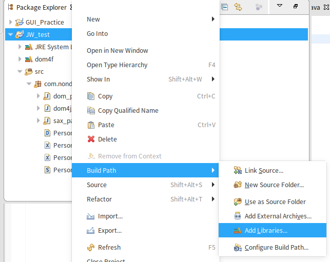
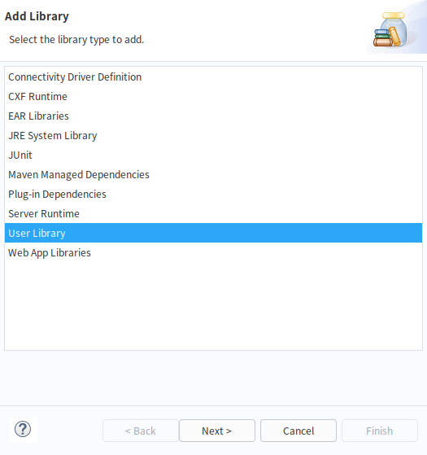
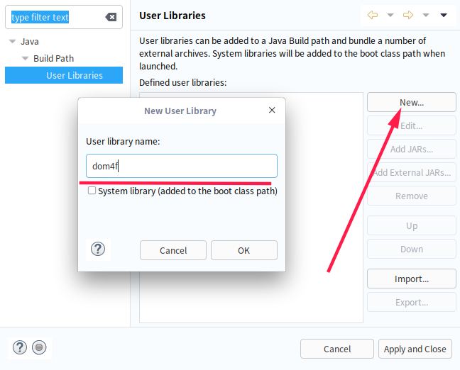
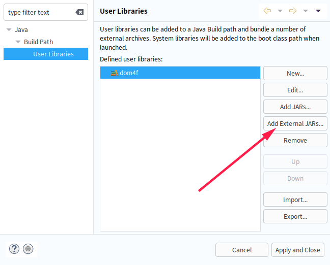
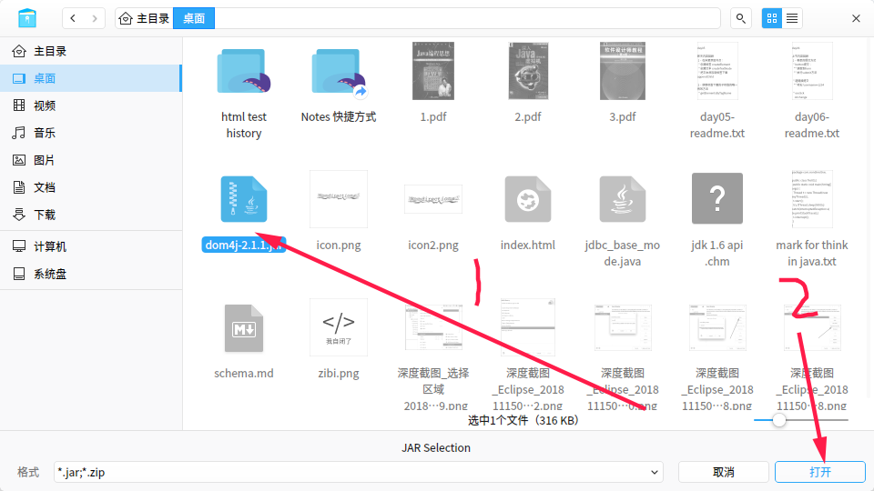

# dom4j

## 安装dom4j

首先在网上搜索dom4j，从官网下载到dom4j的jar包之后











根据图中的一顿操作之后，选择dom4j User Library添加即可

## dom4j解析器的构建

```java
import org.dom4j.io.SAXReader;
import org.dom4j.Document;

SAXReader sr = new SAXReader();
Document document = sr.read(xmlFilePath);
```


## 查询xml文档的基础方法

```java
import org.dom4j.Element;
import java.util.List;

Element root = document.getRootElement();  //获得整个xml文档的根标签
List<Element> list1 = root.elements();  //当前标签下的所有子标签对象
Element e = root.element(tagName);  //获取当前标签下的第一个名为tagName的子标签对象
List<Element list2 = root.elements(tagName);  //获取当前标签下所有名为tagName的子标签对象
e.getName();  //获取标签名称
e.getText();  //获取标签内容
```

下面贴出一个对xml文件遍历的代码例程

```java
import java.util.List;

import org.dom4j.Document;
import org.dom4j.Element;
import org.dom4j.io.SAXReader;

public class dom4j_test{
	public static void main(String[] args) throws Exception{
		SAXReader sr = new SAXReader();
		Document document = sr.read("./Person.xml");
		Element root = document.getRootElement();
		listDocument(root);
	}
	
	public static void listDocument(Element e) {
		System.out.print(e.getName());
		System.out.println(":"+e.getText());
		List<Element> l = e.elements();
		for(Element ele:l) {
			listDocument(ele);
		}
	}
}

```

## 子标签追加

在dom4j当中，我们只要调用父标签对象的`addElement(tagName)` 方法,再然后使用上述方法返回的Element对象使用`setText(stringContent)` 方法编辑其内容，最后把变动回写到xml文件当中就能够完成子标签的追加

```java
import org.dom4j.Document;
import org.dom4j.Element;
import org.dom4j.io.OutputFormat;
import org.dom4j.io.SAXReader;
import org.dom4j.io.XMLWriter;

SAXReader sr = new SAXReader();
Document document = sr.read("./Person.xml");
Element root = document.getRootElement();
Element en = root.addElement("name");
Element ef = en.addElement("firstName");
Element el = en.addElement("lastName");
ef.setText("Mari");
el.setText("Ya");
```


## 在特定位置插入标签

在了解特定位置插入元素之前，首先要了解一个document对象的层次结构

document对象是一个被解析后的整个xml文档对象

`Element root = document.getRootElement()` 拿到整个文档根标签的对象

`List<Element> elementList = root.elements()` 拿到root下的所有标签对象

其中root是document的成员变量,elementList是root的成员变量

我们需要在特定位置插入一 个标签，只要操作elementList对象，在目标位置插入目标标签对象即可

同样的子标签追加也可以像这样操作

```java
public static void main(String[] args) throws Exception{
	SAXReader sr = new SAXReader();
	Document document = sr.read("src/com/nondirectional/Person.xml");
	Element root = document.getRootElement();
	
	List<Element> ls = root.elements();
	Element e = DocumentHelper.createElement("psn:telephoneNumber");
	e.setText("15521999454");
	ls.add(1,e);
	}
```

- 创建标签对象使用的是org.dom4j.DocumentHelper对象的静态方法createElement(tagName)

## 删除标签

删除标签我在这里给出两个方法，一个是参照插入标签，另外一个是拿到目标标签对象的父标签对象，调用父标签对象的remove方法删除子标签

- 方法一：使用父标签的remove方法

  ```java
  Element root = document.getRootElement();
  
  Element childTag = root.element("telephoneNumber");
  Element parentTag = childTag.getParent();
  parentTag.remove(childTag);
  ```

  

- 方法二：操作List对象

```java
List<Element> ls = root.elements();
for(Element e:ls) {
	if(e.getName().equals("telephoneNumber")) {
		ls.remove(e);
	}
}
```


## 属性值的操作

对属性值的操作首先需要拿到标签对象,然后用到以下方法

- `Attribute attribute(attibuteName)` 根据属性名称拿到Attribute对象
- `List<Attribute> attributes()` 拿到当前标签下所有属性的List对象
- `attribute.setValue(value)` 设置属性值
- `String attribute.getValue()` 获取属性值

简单举例：

```java
List<Attribute> ats = root.attributes();
for(Attribute a:ats) 
	System.out.println(a.getName()+":"+a.getValue());
```


## 回写xml文档

```java
XMLWriter xw = new XMLWriter(new FileOutputStream("./Person.xml"), OutputFormat.createPrettyPrint());  
xw.write(document);
```

在`XMLWriter(new FileoutputStream("./Person.xml"), OutputFormat.createPrettyPrint());` 这段代码中

- 第一个参数就表示回写的xml文档的文件输出流
- 第二个参数是回写文档的格式 ,传入`OutputFormat.createPrettyPrint()` 就表明回写xml文档将使用漂亮的格式


## 在dom4j当中使用XPath

使用到两个方法

- Document.selectNodes(XPathGrammer):获得所有满足表达式的标签对象
- Document.selectSingleNode(XPathGrammer):获得一个满足表达式的标签对象

XPath的使用语法参照当前目录下的XPath帮助文档