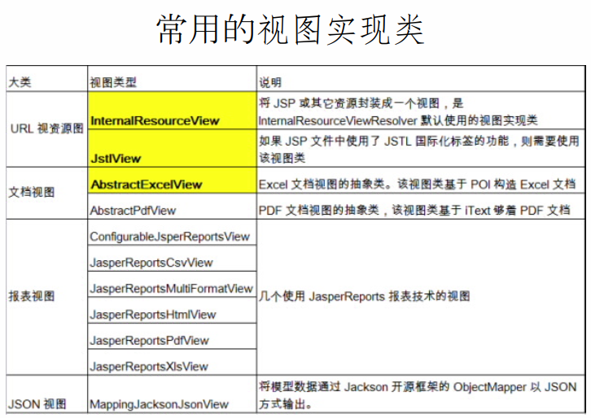
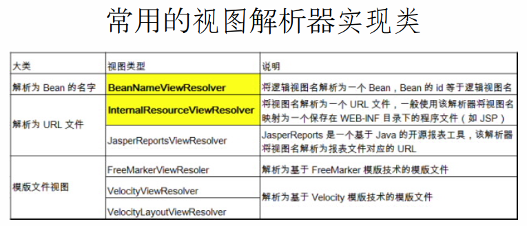
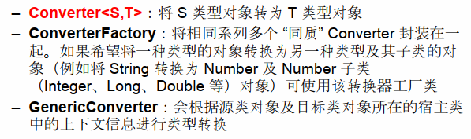

# Spring-mvc

## HelloWorld

### Step1. 依赖包

-   spring-web
-   spring-webmvc
-   spring-core
-   spring-servlet-api

### Step2.配置web.xml

配置DispatcherServlet


手动配置

web.xml下

```xml
<web-app xmlns:xsi="http://www.w3.org/2001/XMLSchema-instance"
	xmlns="http://java.sun.com/xml/ns/javaee"
	xsi:schemaLocation="http://java.sun.com/xml/ns/javaeehttp://java.sun.com/xml/ns/javaee/web-app_3_0.xsd"
	id="WebApp_ID" version="3.0">
	<servlet>
		<servlet-name>springDispatcherServlet</servlet-name>
		<servlet-class>
			org.springframework.web.servlet.DispatcherServlet
		</servlet-class>
        <!--
		还可以在该Servlet中配置以下标签来指定BeanConfig配置文件的路径
		如果不手动指定,则默认的BeanConfig配置文件为{servlet-name}-servlet.xml
		<init-param>
			<param-name>
				contextConfigLocation
			</param-name>
			<param-value>
				classpath:/dispatcherServlet-servlet.xml
			</param-value>
		</init-param>
		-->
		<load-on-startup>1</load-on-startup>
	</servlet>

	<servlet-mapping>
		<servlet-name>springDispatcherServlet</servlet-name>
		<url-pattern>/</url-pattern>
	</servlet-mapping>
</web-app>

```

### Step3.BeanConfig配置文件

开启包扫描

装配org.springframework.web.servlet.view.InternalResourceViewResolver

```xml
<context:component-scan base-package="com.nond.springmvc"></context:component-scan>

<bean class="org.springframework.web.servlet.view.InternalResourceViewResolver">
	<property name="suffix" value=".jsp"></property>
	<property name="prefix" value="/WEB-INF/pages/"></property>
</bean>
```


### Step4.配置Controller

```java
@Controller
public class HelloWorld {
	
    //说明应答http://localhost:8080/projectName/HelloWorld这个请求
	@RequestMapping("/HelloWorld")
	public String helloWorld() {
		System.out.println("HelloWorld Call");
		return "success";
	}
}

```


## @RequestMapping

在SpringMVC中**@RequestMapping**注解的作用是用来声明，当前控制器是用来处理哪些请求的


该注解能够标注在类、方法上


标注在类上

提供初步的映射信息


标注在方法上

提供进一步的映射信息


value属性

映射信息


method属性 

映射对应的请求方法


params属性

限定请求参数

如`!param1`，请求不包含param1

​	`param1 != value1`，请求的param1参数值不为value1


headers属性

同params属性相类似，用于限定请求的请求头


@RequestMapping的value属性支持的三种匹配符

* *：匹配多个字符
* ？：匹配一个字符
* **：匹配多层路径


## @PathVariable

通过**@PathVariable**能够将URL中占位符参数绑定到控制器方法的入参当中

如

```java
@RequestMapping(value = "/xxx/{name}")
public String func01(@PathVariable("name")String name){
    System.out.println(name);
    return "success";
}
```


## 发出Put、Delete请求


表单

```xml
<form action="xxx" method="post">
	<input type="hidden" name="_method" value="PUT"/>
    <input type="submit" value="Put"/>
</form>
```


web.xml当中配置filter

```xml
<filter>
	<filter-name>HiddenHttpMethodFilter</filter-name>
    <filter-class>org.springframework.web.filter.HiddenHttpMethodFilter</filter-class>
</filter>
<filter-mapping>
	<fitler-name>HiddenHttpMethodFilter</fitler-name>
    <url-pattern>/*</url-pattern>
</filter-mapping>
```


## @RequestParam

获取请求参数化为入参


```java
@RequestMapping("/test")
public String func(@RequestParam(value="参数名称",required="布朗值，参数是否为必须" defalutValue="该参数为提供的情况下默认值为null，未提供参数时的默认值"))
```


## @RequestHeader

获取请求头为入参

```java
@RequestMapping("/test")
public String func(@RequestHeader(value="参数名称",required="布朗值，参数是否为必须" defalutValue="该参数为提供的情况下默认值为null，未提供参数时的默认值"))
```


## @CookieValue

获取Cookie值为入参

value属性为Cookie的名称


MVC能够通过请求参数以及控制器的入参自动的创建对象

如参数username,password,address.province,address.city

入参user


还能够一Servlet API作为入参，Spring mvc将会自动的将对应对象传入


支持的ServletAPI 

-   HttpServletRequest 
-   HttpServletResponse 
-   HttpSession 
-   java.security.Principal 
-   Locale 
-   InputStream 
-   OutputStream 
-   Reader 
-   Writer

## 在域对象中设置属性


### requestScope当中设置


#### 使用ModelAndView

使用ModelAndView需要指定视图对象，即已经包含了视图信息在内

```java
@RequestMapping("/testModelAndview")
public ModelAndView testModelAndView(){
    //传入视图名称创建ModelAndView对象
    ModelAndview modelAndView = new ModelAndView("success");
    //插入对象键值对
    modelAndView.addObject("name","Hari");
}

//在视图当中获取对象,success.jsp
${requestScope.name}
```


#### 使用Map

```java
@RequestMapping("/testMap")
public String testMap(Map<String, Object> models) {
	models.put("name", "Hari");
	return "success";
}
```


### SessionScope当中设置

#### 使用SessionAttibutes

使用@SessionAttributes标注类 

@SessionAttributes有两个属性

value:指定插入到session当中的键

type:指定插入到session当中的数据类型


```java
@SessionAttributes(value={"user"})
public class TestSessionAttribute

@RequestMapping("/testSessionAttribute")
public String testSessionAttibute(Map<String,Object> map) {
	User u = new User();
	u.setUsername("hari");
	u.setPassword("hhh123");
	map.put("user", u);
	return "success";
}
```


## @ModelAttribute


### 使用情景

  	接受部分Bean属性，保留敏感信息，确敏感信息的安全。

​	如，修改用户名和email，保留原本的登录密码


### @ModelAttribute标注后控制器目标方法的运行流程

注意:@ModelAttribute注解标记的方法，在控制器的每一个方法执行前都会调用一次


表单

```html
<form action="/spring-mvc/testModelAttribute" method="post">
oldName:
<input type="text" name="oldName"/>

<br/>
newName:
<input type="text" name="username"/>

</br>

<input type="submit"/>
</form>
```


控制器

```java
@ModelAttribute
public String getUser(@RequestParam(value="oldName",required=false,defaultValue="")String 

name,Map<String,Object> m){
	if(!"".equalss(oldName)){
		m.put("user",UserDao.queryUser(oldName));
		System.out.println("Query by old username...");
	}
}

@RequestMapping("/testModelAttribute")
public String testModelAttribute(@RequestParam(value="oldName",User user){
	UserDao.UpdateByUserName(oldName,user);
	System.out.println("Update..."+user);
}
```


页面发出请求，@ModelAttribute标注的方法先拦截到ServletRequest对象

@ModelAttribute注解标注的getUser方法根据请求参数oldName查询到User对象并且通过Map插入到请求

对象当中，键名为"user"

此时请求对象当中有

> ​	"oldName": "oldname"
> ​	"username":"newname"
> ​	"user":["username":"oldname","password":"password"]


请求对象的目标方法为@RequestMapping("testModelAttibute")标注的方法

springmvc将请求对象中的属性，按照属性名赋值给请求对象当中的"user"对象


此时请求对象
>	​	"oldName": "oldname"
>​	"username":"newname"
>​	"user":["username":"newname","password":"password"]

最后，springmvc再把键名为"user"的对象传给入参User user


​	注意:默认情况下,控制器目标方法的入参类型为User,入参对象接受对象的键名就为"user"，即

入参数据类型的首字母小写。
	如果，需要指定接口对象的键名，给入参对象使用@ModelAttribute标注,value值指定接收对象

的键名
```java
public String testModelAttribute(@RequestParam(value="oldName",@ModelAtrribute
("user") User user){
		...
	}
```


### 确定POJO类型入参的过程

1. 确定一个key
    1. 入参有无**@ModelAttribute**标注，有则**key**为注解**@ModelAttribute**指定的名称
    2. 无则为入参类型的首字母小写
2. **ImplicitModel**当中查找与key相对相应的对象
    1. 有则取出对象作为入参传入
    2. 无且控制器类有**@SessionAttributes**标注有类型或名称与key对应的对象则在Session域中取出传入，没有找到则抛出异常
    3. 如果没有**@SessionAttributes**注解，则根据反射创建对象


## 视图


### 视图解析的流程

首先需要知道无论控制器目标方法返回的是String,ModelAndView,ModelMap，springmvc都会把他们转换成ModelAndView在ModelAndView对象当中包含了Model和View


常见View的实现如下




然后ModelAndView移交给视图解析器进行解析

常用的视图解析器实现如下





### 直接转发不经过handler

```xml 
<!--如果单纯只配置view-controller,原本经过handler的转发将会出现异常-->
<mvc:view-controller path="/targetPath" view-name="success"/>
<!--如果需要原本经过handler的转发成功，需要配置annotation-driven-->
<mvc:annotation-driven></mvc:annotation-driven>
```


### 自定义视图

自定义一个视图，输出当前请求的所有请求参数


创建CustomView

```java
public class CustomView implements View {
	//视图的数据类型
	public String getContentType() {
		return "text/html";
	}
    
	//解析视图
	public void render(Map<String, ?> model, HttpServletRequest request, HttpServletResponse response)
			throws Exception {
		Writer writer = response.getWriter();
		if(model.isEmpty()) 
			writer.append("Model map empty.");
		else 
			for(Entry<String, ?> e:model.entrySet()) 
				writer.append("Model key:"+e.getKey()+"|Model value:"+e.getValue()+"<br/>");
	}

}
```


配置一个BeanNameViewResolver到上下文

```xml
<bean class="org.springframework.web.servlet.view.BeanNameViewResolver">
    <!--指定视图解析器的优先级-->
	<property name="order" value="100"></property>
</bean>
```

BeanNameViewResolver视图解析器是根据bean的名称来

访问到自己的视图

```java
	@RequestMapping("testCustomView")
	public Object testCustomView(HttpServletRequest request,Map<String,Object> m) {
		Enumeration<String> parameterNames = request.getParameterNames();
		while(parameterNames.hasMoreElements()) {
			String name = parameterNames.nextElement();
			m.put(name, request.getParameter(name));
		}
		return new CustomView();
	}
```

## 数据绑定


### 数据绑定流程

页面发出请求->ServletRequest对象

ServletRequest对象、控制器目标方法的入参对象以及入参对象的名称(默认没有@ModelAttribute指定的情况下为对象类名的首字母小写)交给WebDataBinderFactory
WebDataBinderFactory创建**DataBinder**对象

DataBinder根据上下文当中的

* **ConversionService**:进行数据转换，数据格式化
* **Validator**：进行数据合法性校验

然后根据处理结果生成BindingData对象

最后在BindingResult中抽取出入参对象和错误对象赋值给入参对象

### 自定义数据类型转换器

Spring支持三种数据转换器接口，如下



实现自定义类型转换器类

```java
@Component("CustomConverter")
public class CustomConverter implements Converter<String, Person> {
	
    //接受一行字符串，解析字符串为String属性name和age
	public Person convert(String source) {
		String[] strs = source.split(":");
		Person person = new Person();
		person.setName(strs[0]);
		person.setAge(Integer.parseInt(strs[1]));
		return person;
	}
}

```

要使用到自定义的类型转换器，除了实现相应接口以外，还需要

1.  配置一个ConversionServiceFactoryBean到容器中

    ```xml
    <bean class="org.springframework.context.support.ConversionServiceFactoryBean" name="ConversionService">
        <!--属性接收一个 Set,Set的元素为类型转换器Bean
    	<property name="converters">
    		<set>
    			<ref bean="CustomConverter"></ref>
    		</set>
    	</property>
    </bean>
    ```

    

2.  在BeanConfig中配置annotation-driven标签，指定ConversionService

    ```xml
    <mvc:annotation-driven conversion-service="ConversionService"></mvc:annotation-driven>
    ```

## 静态资源请求

​	将DispatcherServlet映射路径配置为/，spring mvc将会捕捉web容器当中所有的请求（包括静态资源请求），在这种情况下静态资源的请求如果没有对应的Controller进行处理的话，项目将会出现异常。Spring mvc针对这种情况给出了下面这种解决方案

​	在BeanConfig中配置`<mvc:default-servlet-handler/>`标签

配置该标签后，会在Spring mvc上下文中注册一个**DefaultServletHttpRequestHandler**组件，该组件会检查DispatcherServlet拦截的请求，如果是静态资源请求则交于web应用服务器进行处理，否则继续给DispatcherServlet处理


## mvc:annotation-driven标签的作用

首先有两个应用情景:

​	配置了`<mvc:view-controller path="/sucesss" view-name="success"></mvc:view-controller>`标签或`<mvc:default-servlet-handler/>`标签

配置了前者之后，Spring mvc无法判断页面的请求是不经过Handler直接转发还是通过Handler处理，导致了@RequestMapping映射的路径无法正确访问。

配置了后者之后，Spring mvc无法判断页面的请求是静态资源请求还是mvc的注解，又导致了@RequestMapping映射路径无法正确访问

但是加上了mvc:annotation-driven标签之后，前面的问题就解决了，为什么？


使用了mvc:annotation-driven后，Spring mvc默认会帮我们注册默认处理请求，参数和返回值的类，其中最主要的两个类，它们分别为HandlerMapping的实现类和HandlerAdapter的实现类

-   DefaultAnnotationHandlerMapping 

    实现类RequestMappingHandlerMapping，它会处理@RequestMapping 注解，并将其注册到请求映射表中。

    

-   AnnotationMethodHandlerAdapter 

    实现类RequestMappingHandlerAdapter，则是处理请求的适配器，确定调用哪个类的哪个方法，并且构造方法参数，返回值


当配置了mvc:annotation-driven后，Spring就知道了我们启用注解驱动。然后Spring通过context:component-scan标签的配置，会自动为我们将扫描到的@Component，@Controller，@Service，@Repository等注解标记的组件注册到工厂中，来处理我们的请求


除此之外，配置了mvc:annotation-driven后还提供一下支持

-   支持ConversionService实例对表单参数进行数据转换
-   支持NumberFormat注解、DateTimeFormat注解完成数据的格式化
-   支持使用Vaild注解对JavaBean进行JSR 303数据校验
-   支持使用RequestBody、ResonponseBody注解

