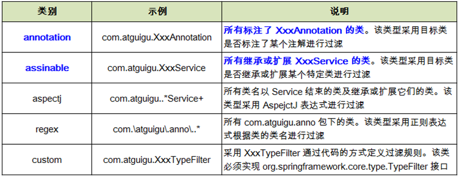

# Spring IoC&DI(XML)


## 概念

IoC(Inversion of Control)控制反转

通过控制反转，对象在被创建的时候，由一个调控系统内所有对象的外界实体将其所依赖的对象的引用传递给它。也可以说，依赖被注入到对象中。

软件工程中对象之间的耦合度就是对象之间的依赖性。指导使用和维护对象的主要问题是对象之间的多重依赖性。对象之间的耦合越高，维护成本越高。

 DI (Dependency inject)依赖注入

当前对象需要哪些对象，将对象注入到当前对象中

 

Spring的容器在每个项目当中只创建一个

想要确保在项目当中只创建一个`ApplicationContext`可以使用到`ServletListener`的八个监听器中的`ServletContext`创建销毁监视器。除此之外我们还能够把`ApplicationContext`注入到`ServletContext`域对象当中，便于在项目中取用bean。

同是，要完成 上述操作也是非常的方便的，Spring已经把这个监听器定制好了，只要在导入``Spring-web` jar包，在`web.xml`文件下配置

```xml
<listener>
	<listener-class>org.springframework.web.context.ContextLoaderListener</listener-class>
</listener>
<!--指定加载Spring配置文件的位置-->
<context-param>
      <param-name>contextConfigLocation</param-name>
      <param-value>
            classpath*:/applicationContext.xml
      <!--
		classpath：只会到你的class路径中查找找文件; 
		classpath*：不仅包含class路径，还包括jar文件中(class路径)进行查找.
		注意： 
用classpath*:需要遍历所有的classpath，所以加载速度是很慢的，因此，在规划的时候，应该尽可能规划好资源文件所在的路径，尽量避免使用 classpath*
		-->
      </param-value>
</context-param>
```


### 使用案例案例

假设有`Person`和`Computer`类,`Person`拥有`Computer`对象(即Person依赖Computer)

```java
//Person.java

public class Person{
    private Computer computer;
    public void setComputer(Computer c){
        this.computer = c;
    }
}
```

```java
//Computer.java

public class Computer{
    private String computerName;
    Computer(){
		this.computerName = "null";
    }
}
```


在resource/static目录下创建Spring config xml文件

```xml
<?xml version="1.0" encoding="UTF-8"?>
<beans xmlns="http://www.springframework.org/schema/beans"
       xmlns:xsi="http://www.w3.org/2001/XMLSchema-instance"
       xsi:schemaLocation="http://www.springframework.org/schema/beans
                           http://www.springframework.org/schema/beans/spring-beans.xsd">
    <bean id="Person" class="com.example.demo.Person">
    <!--Person p = new Person();-->
	<!--id为使用时引入bean时使用的ID，class时bean的完整类名 -->
        <property name="Computer" ref="com.example.demo.Computer">
        <!--说明Person依赖Computer，通过Person的setComputer()方法把Computer注入Person中
		<!--Person.setComputer(c);-->
		</property>
    </bean>
    
    <bean id="Computer" class="com.example.demo.Computer">
    <!--Computer c = new Computer();-->
    </bean>
</beans>
```
配置bean使用全类名，IoC使用反射的方式在容器当中创建bean

在xml配置文件当中说明IoC和DI
`<bean>` 标签说明这个bean是IoC，要拿到实例需要从容器中获取
`<property>`标签说明这个属性是DI，bean中依赖这个对象，需要容器把实例注入到这个bean中

然后，需要获得对象的实例就要得到BeanFactory，从BeanFactory当中得到对象实例


BeanFactory是面向Spring底层的，我们开发者使用到的是ApplicationContext

两者的区别是,BeanFactory在需要使用到实例的时候才会创建实例，而ApplicationContext在创建的时候就会创建实例


主要使用到的拓展自ApplicationContext的实现类和接口

* ClasspathXmlApplicationContext

    在classpath路径下加载XML文件

* FileSystemXmlApplicationContext

    在本地文件系统下加载XML配置文件


## 使用Factory和Context两种方式获取bean的区别

1. BeanFactory方式配置(需要用到对象实例的时候才创建对象实例)

```java
    String xmlPath = "static/beans.xml";
    org.spring.core.io.Resourece resource = new ClassPathResourece(xmlPath);
    BeanFactory beanFactory = new org.springframework.beans.factory.xml.XmlBeanFactory(resource);
    Person p = (Person)applicationContext.getBean("PersonId");
    return "name:"+p.getName()+";sex:"+p.getSex();

```
2. ApplicationContext方式配置(初始化的时候就把对象的实例创建好)

这种方式的BeanFactory有两种常用的实现类，FileSystemXmlApplicationContext和ClassPathXmlApplicationContext。分别是基于文件系统绝对路径的和基于classpath相对路径的
在这里就以ClassPathXmlApplicationContext为例子

```java
    String xmlPath = "static/beans.xml";
    ApplicationContext applicationContext = new ClassPathXmlApplicationContext(xmlPath);
    Person p = (Person)applicationContext.getBean("PersonId");
    return "name:"+p.getName()+";sex:"+p.getSex();
```
先引入`ApplicationContext`对象后再使用`applicationContext`对象的`getBean()`方法就可以拿到实例


## 生成Bean的三种方式

1. 空参数构造创建(即上文使用的方式)

2. 静态工厂(了解)

    ​	配置一个有生成目标Bean的静态方法的工厂Bean,通过静态方法获取目标Bean

    1. 创建工厂类，设置一个获取目标bean的静态方法
    2. 把bean设置到bean.xml,比普通构造`<bean id="PersonId" class="com.example.demo.controller.Person">` 的不同之处是，class指定的将是beanFactory的路径，同时在指定beanFactory当中的获得bean的静态方法

```xml
<?xml version="1.0" encoding="UTF-8"?>
<beans xmlns="http://www.springframework.org/schema/beans"
       xmlns:xsi="http://www.w3.org/2001/XMLSchema-instance"
       xsi:schemaLocation="http://www.springframework.org/schema/beans
                           http://www.springframework.org/schema/beans/spring-beans.xsd">
    <bean id="PersonId" class="com.example.demo.Person" factory-mehtod="getPerson">
    </bean>
</beans>
```


3. 实例工厂

实例工厂的bean配置方式是把一个bean工厂的实例交给spring，我们向spring请求需要一个对象的时候，通过spring返回一个对象

```xml
<?xml version="1.0" encoding="UTF-8"?>
<beans xmlns="http://www.springframework.org/schema/beans"
       xmlns:xsi="http://www.w3.org/2001/XMLSchema-instance"
       xsi:schemaLocation="http://www.springframework.org/schema/beans
                           http://www.springframework.org/schema/beans/spring-beans.xsd">
    <bean id="BeanFactoryId" class="com.example.demo.myBeanFactory"></bean>
    <!--工厂对象-->
    <bean id="PersonId" class="com.example.demo.Person" factory-bean="BeanFactoryId" factory-method="getPerson"></bean>
    <!--Person对象，说明要获得他需要通过的工厂，和在工厂中要使用到的get方法-->
</beans>
```


## bean的作用域

在xml配置bean的时候加入scope属性，以设置Bean的作用域

```xml
<?xml version="1.0" encoding="UTF-8"?>
<beans xmlns="http://www.springframework.org/schema/beans"
       xmlns:xsi="http://www.w3.org/2001/XMLSchema-instance"
       xsi:schemaLocation="http://www.springframework.org/schema/beans
                           http://www.springframework.org/schema/beans/spring-beans.xsd">
<bean id="BeanFactoryId" class="com.example.demo.myBeanFactory"></bean>
<bean id="PersonId" class="com.example.demo.Person" factory-bean="BeanFactoryId" factory-method="getPerson" scope="singleton"></bean>
</beans>
```

**singleton**: 每次请求获取的都是同一个实例

**prototype**: 一次请求生成一个实例

**request**: 一次请求共用一个实例

**session**: 一次回话共用一实例

*在未来的开发中，绝大多数scope的取值都是使用默认值，但是Spring与Struts2整合时，action对象要交给Spring来管理，action这个bean得配置为prototype。因为Struts2从架构上来说，每次请求都会创建一个新的action。*


## 分模块配置文件

多模块组成配置文件，分模块导入到总模块当中

使用到`<import resource="分模块文件路径"`


## 属性注入

### set方法注入

每个注入的属性都要有对应的Setter方法

```java
//Person.java
public class Person{
    private Computer computer;
	public void setComputer(Computer computer){
        this.computer = computer;
    }    
}

//Computer.java
public class Computer{
    private double price;
    public void setPrice(double price){
        this.price = price;
    }
}
```


```xml
<bean name="Computer" class="com.demo.Computer">
    <!--值注入，适用于八大基本类型-->
	<property name="price" value="13888"></property>
</bean>

<bean name="Person" class="com.demo.Person">
    <!--引用注入-->
	<property name="Computer" ref="Computer"></property>
</bean>
```


### 构造方法注入 

```java
 public class Person{
     private String age;
     private Computer computer;
     
     Person(String age,Computer computer){
         this.age = age;
         this.computer = computer;
     }
     
     Person(Computer computer,String age){
         this.age  = age;
         this.computer = computer;
     }
     
     Person(Integer age,Computer computer){
         this.age = age+"";
         this.computer = computer;
     }
 }
```

正常构造注入(使用第一个构造方法,在Peron没有其他两个构造方法的情况下)

```xml
<bean name="Person" class="com.demo.Person">
	<constructor-arg name="age" value="18"></constructor-arg>
    <constructor-age name="computer" ref="Computer"></constructor-age>
</bean>
<bean name="Computer" class="com.demo.Computer"></bean>
```

指定参数顺序注入(使用第二个构造方法)

```xml
<bean name="Person" class="com.demo.Person">
	<constructor-arg name="age" value="18" index="1"></constructor-arg>
    <constructor-age name="computer" ref="Computer" index="0"></constructor-age>
</bean>
<bean name="Computer" class="com.demo.Computer"></bean>
```

指定参数类型注入(使用第三个构造方法)

```xml
<bean name="Person" class="com.demo.Person">
	<constructor-arg name="age" value="18" type="java.lang.Integer"></constructor-arg>
    <constructor-age name="computer" ref="Computer" type="com.demo.Computer"></constructor-age>
</bean>
<bean name="Computer" class="com.demo.Computer"></bean>
```


### 使用p名称空间注入

p名称空间注入本质上就是set方法注入，不同点就是使用了名称空间对set方法注入进行了简化


使用前xml配置文件需要引入p名称空间`xmlns:p="http://www.springframework.org/schema/p"`

```xml
<!--注入值-->
<bean name="Person" class="com.demo.Person" p:computer-ref="Computer"></bean>
<!--注入引用-->
<bean name="Computer" class="com.demo.Computer" p:price="13888"></bean>
```


### 属性注入的值有特殊字符时

使用`<!CDATA[]>`标签包裹

```xml
<bean name="Person" class="com.demo.Person">
	<property  name="name">
    	<value><!CDATA[<name>]></value>
    </property>
</bean>
```


### 内部Bean

在property标签内配置bean，这种方式的bean在其他位置是无法访问的

```xml
<bean name="Person" class="com.demo.Person">
	<property name="Computer">
    	<bean name="Computer" class="com.demo.Computer">		</bean>
    </property>
</bean>
```


在xml当中赋null值

使用`<null/>`标签


### 配置集合属性


#### Array、Set和List

三种集合的配置方法都大同小异分别使用`<array>`、`<set>`、`<list>`标签

在这里使用Array来举例说明

```xml
<bean name="Person" class="com.demo.Person">
	<property name="Computers">
    	<array>
        	<ref bean="Computer_1"></ref>
            <ref bean="Computer_2"></ref>
        </array>
    </property>
</bean>

<bean name="Computer_1" class="com.demo.Computer">
	<property name="name" value="lenovo"></property>
</bean>

<bean name="Computer_2" class="com.demo.Computer">
	<property name="name" value="tonshiba"></property>
</bean>
```


#### 配置Map

```xml
<bean name="Person" class="com.demo.Person">
	<property name="Computers">
    	<map>
        	<entry key="levono" value="3999"></entry>
            <entry key="tonshiba" value="8888"></entry>
        </map>
    </property>
</bean>
```


如果key或者value是引用类型，将属性替换成`key-ref`或`value-ref`即可


### 配置Propteries

Spring为配置Properties专门设置了`<props>``<prop>`标签

有以下类

```java
public class Setting{
    private Properties properties;
    
    public void setProperties(Properties properties){
        this.properties = properties;
    }
    
    public Properties getProperties(){
        return this.properties
    }
}
```

配置如下

```xml
<bean name="Setting" class="com.dmeo.Setting">
	<property name="Properties">
    	<props>
        	<prop key="username">hlly888</prop>
            <prop key="password">hhh123</prop>
        </props>
    </property>
</bean>
```


### 集合类型抽取成公共bean

beans标签引入`xmlns:util="http://www.springframework.org/schema/util"`,xsi:schemaLocation加入`http://www.springframework.org/schema/util http://www.springframework.org/schema/util/spring-util-4.0.xsd`

```xml
<bean name="Person" class="com.demo.Person">
	<property name="Computers" ref="Computers"></property>
</bean>

<util:map id="Computers">
	<entry key="levono" value="3599"></entry>
    <entry key="tonshiba" value="3999"></entry>
</util:map>
```

需要注意原先map标签后使用的name属性在util:map标签当中需要替换成id属性

余下集合类型的独立配置与map相似


### 自动装配bean

在xml当中自动装配bean有三种方式

* byName(根据name属性或id属性自动装配)
* byType(根据bean的类型自动装配)
* constructor(构造方法装配不建议使用)

需要注意使用byType方式自动装配时，存在多个相同类型的bean时，将会无法正常装配 

byName自动装配

```xml
<bean name="car" class="com.demo.Car" p:brand="BYD" p:price="129999"></bean>
<bean name="address" class="com.demo.Address" p:city="guangdong" p:street="laolong"></bean>
<bean name="Person" class="com.demo.Person" p:name="Hari" autowire="byName"></bean>
```


### bean之间的关系

bean可以作为一个模板或者父bean被继承，标签当中的所有属性都会被继承，而且被子标签继承之后所有属性都能够被覆盖。bean还能够作为一个模板专门用于被继承，需要把abstract属性设置为true(这项属性被设置以后,class属性还能再被继承之后由子标签指定)

```xml
<bean name="commodity" p:brand="Nike" p:price="1299" abstract="true"></bean>
<bean name="nike_shoe" p:price="699" class="com.demo.Shoe" parent="commodity"></bean>
```


### 使用外部属性文件加载属性

在配置文件里配置 Bean 时, 有时需要在 Bean 的配置里混入**系统部署的细节信息**(例如: 文件路径, 数据源配置信息等). 而这些部署细节实际上需要和
Bean 配置相分离

Spring 提供了一个 PropertyPlaceholderConfigurer 的 **BeanFactory** **后置处理器**, 这个处理器允许用户将 Bean 配置的部分内容外移到**属性文件**中. 可以在 Bean 配置文件里使用`${var}`形式为的变量, PropertyPlaceholderConfigurer 从属性文件里加载属性, 并使用这些属性来替换变量.

Spring 还允许在属性文件中使用 `${propName}`，以实现属性之间的相互引用


使用

1. 配置properties资源文件

2. 在ApplicationContext.xml当中注册PropertyPlaceholderConfigurer

    * Spring2.5以前

    	```xml
    	<bean class="org.springframework.beans.factory.config.PropertyPlaceholderConfigurer">
    		<property name="location" value="classpath:ApplicationContext.xml"></property>
    	</bean>
    	```

    * Spring2.5以后

        ​	引入context命名空间
        
        ```xml
<context:property-placeholder location="classpath:db.properties"/>
        ```
        
        

## SpEL(Spring Expression Language)

### 表示字面值

```xml
<!--整数-->
<property name="age" value="#{18}"></property>
<!--浮点数-->
<property name="height" value="#{175.0}"></property>
<!--字符串-->
<property name="name" value="#{"Hari"}"></property>
<!--科学计数法-->
<property name="balance" value="#{1e6}"></property>
<!--布朗值-->
<property name="isGirl" value="{false}"></property>
```

### 引用对象，对象方法，对象属性

```xml
#{Persosn}
#{Person.name}
#{Person.toString()}
```

### SpEL当中可使用的运算符

```xml
#{+-*/%^}
<!-- + 还能够用于拼接字符串如#{"Hello"+" "+"World!"}-->
所有的比较运算符
and or not
<!--三元运算符-->
#{1>2?ture:false}

```

### 调用静态方法、属性

```xml
#{T(java.lang.Math).PI}
#{T(java.lang.Integer).parseInt("123456")}
```


## IoC中bean的生命周期

bean的生命周期

1. 构造器或工厂方法创建bean实例
2. 设置bean的属性
3. 调用bean的初始化方法
4. bean可以使用
5. 销毁bean，调用bean的销毁方法 

**在 Bean 的声明里设置 init-method 和 destroy-method 属性, 为 Bean 指定初始化和销毁方法.**

在Spring当中能够添加bean的后置处理器，在init-mehtod执行前后对bean进行处理


创建实现BeanPostProcesser接口的bean后处理器类	

```java
public class TestBeanPostProcessor implements BeanPostProcessor{
	//init前
	@Override
	public Object postProcessBeforeInitialization(Object bean, String beanName) throws BeansException {
		System.out.println("before init-->"+((Test)bean).getName());
		((Test)bean).setName("Mari");
		return bean;
	}
    //init后    
    @Override
	public Object postProcessAfterInitialization(Object bean, String beanName) throws BeansException {
		System.out.println("after init-->"+((Test)bean).getName());
		return bean;
	}

}
```


在ApplicationContext.xml中配置bean后处理器

```xml
<bean name="test" class="com.demo02.Test" p:name="Hari" init-method="init" destroy-method="destory"></bean>

<!--配置bean后处理器-->
<bean class="com.demo02.TestBeanProcesser"></bean>
```


## FactoryBean配置Bean


### 使用FactoryBean的作用

spring往IOC容器中添加Bean的方式有很多种，例如在xml中使用bean标签，使用 @Bean 、@Component 等注解，那为什么还要设计这么一种方式给容器中添加Bean呢？主要原因是为了服务第三方类。
我们在一个项目中除了使用Spring框架以外，可能还要用到其他很多第三方框架，例如 ORM 框架 mybatis ，为了使用IOC容器进行解耦，我们需要将第三方框架中的核心类加入到spring的IOC容器中去，那怎么加进去呢？我们不能修改第三方框架的代码，因此在类上加入 @Compontent 或其他注解肯定是不行的，于是我们还可以使用 bean 标签在xml文件中定义，这种方式行不通，原因是如果我们需要添加的 Bean有很多属性，则 bean标签的数量会让任何一个程序员崩溃。当然还可以在配置类中使用 @Bean 注解，自己new一个这个对象，然后加入到IOC容器中去，这种方式固然可以，但是局限也很大，此时的IOC容器需要是 AnnotationConfigApplicationContext 这种类型，如果我们还想使用 @Component 或者 @Service 等注解灵活在添加到容器中，就必须借助 FactoryBean，其实使用起来也非常简单，就如上面的例子，FactoryBean 在各种框架中使用非常广泛。

本文为CSDN博主「InterfaceJ」的原创文章，遵循 CC 4.
原文链接：https://blog.csdn.net/jisuanji12306/article/details/86557711


### FactoryBean的使用 

xml文件当中配置bean时，其他按正常配置需要的bean一样配置，class属性设置为FactoryBean的全类名

```xml
<bean name="test" class="com.demo03.TestFactoryBean">
	<property name="name" value="Hari"></property>
</bean>
```

FactoryBean当中必须要包含需要配置bean的所有属性、以及set方法，否则容器无法把属性注入到bean当中

```java
package com.demo03;

import org.springframework.beans.factory.FactoryBean;

public class TestFactoryBean implements FactoryBean<Test> {
	private String name;
	private Test t;
	{
		t = new Test();
	}
	
	public void setName(String name) {
		this.name = name;
	}
	
	@Override
	public Test getObject() throws Exception {
		t.setName(name);
		return t;
	}

	@Override
	public Class<Test> getObjectType() {
		return Test.class;
	}	
	//是否单例
	@Override
	public boolean isSingleton() {
		return true;
	}

}

```


## 注解配置bean

使用注解方式前需要导入*spring-aop* 包


创建主配置文件 (用于在ClassPath下扫描组件)

```xml
<?xml version="1.0" encoding="UTF-8"?>
<beans xmlns="http://www.springframework.org/schema/beans"
       xmlns:xsi="http://www.w3.org/2001/XMLSchema-instance"
       xmlns:context="http://www.springframework.org/schema/context"
       xsi:schemaLocation="http://www.springframework.org/schema/beans http://www.springframework.org/schema/beans/spring-beans.xsd">

    <!--component可以理解为对象，我们把对象放进容器中，对Spring来说就是把组件放进来了-->
    <!--base-package: 扫描你给的这个包下所有的类，看上面有没有注解。扫描到注解，会启动注解配置。
                      如果这个包下面还有子包的话，还会扫描子包下的类
    -->
    <context:component-scan base-package="com.wisedu"></context:component-scan>
</beans>
```


### 过滤扫描包

resoure-pattern属性设置正则表达式可以过滤不需要的类如`resource-pattern="autowire/*.class"`

使用`<include-filter>`子节点或`<exclude-filter>`能够包含或者排除符合指定过滤表达式的类



用例

```xml
<context:component-scan base-package="com.demo"
                        use-default-filters="false">
	<exclude-filter type="annotation" expression="org.springframework.stereotype.Controller"></exclude-filter>
</context:component-scan>
```

如果需要排除由标有 @Service,@Controller和@Repository 的注解的类，需要把`<context:component-scan>`标签的use-default-filters属性设为false

use-default-filters 属性的默认值为 true，即使用默认的 Filter 进行包扫描，而默认的 Filter 对标有 @Service,@Controller,@Repository和@Compoment注解的所有类进行扫描


### 注册对象

使用到了注解@Component(),除了@Component()之外还有@Repository()、@Service()、@Controller，分别对应Dao层、Service层、Web层,四个注解都是的作用都是把对象注册到IoC容器当中去，只不过后面三个注解的作用是为了区分对象所在的层

```java
@Component("Person")
public class Person{
    
}
```


### autowired自动装配bean

使用`@AutoWired` 注解构造器、属性、带参数的方法，都可以自动装配属性兼容的bean

默认情况下,所有使用@Authwired注解的属性都需要被设置.当Spring找不到匹配的Bean装配属性时,会抛出异常,若某一属性允许不被设置,可以设置@Authwired注解的required属性为false

默认情况下, 当 IOC 容器里存在多个类型兼容的 Bean 时, 通过类型的自动装配将无法工作. 此时可以在 **@Qualifier** 注解里提供 Bean 的名称. **Spring** **允许对方法的入参标注** **@Qualifiter** **已指定注入** **Bean** 的名称


@Authwired 注解也可以应用在**数组类型**的属性上, 此时 Spring 将会把所有匹配的 Bean 进行自动装配.

@Authwired 注解也可以应用在**集合属性**上, 此时 Spring 读取该集合的类型信息, 然后自动装配所有与之兼容的 Bean. 

@Authwired注解用**java.util.Map**上时若该 的键值为 那么 将自动装配与之 值类型兼容的 此时 的名称作为键


Spring 4.0之后还加入了泛型依赖注入特性

对于设置为泛型的成员使用`@autowired`注入时，Spring容器会自动的寻找相匹配的实现泛型接口的类或泛型类的子类进行注入