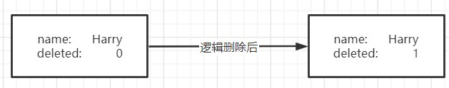

# Mybatis Plus

## 相关依赖

```xml
<!--Mybatis Plus-->
<dependency>
	<groupId>com.baomidou</groupId>
	<artifactId>mybatis-plus-boot-starter</artifactId>
	<version>3.3.1</version>
</dependency>
<!--Lombok-->
<dependency>
	<groupId>org.projectlombok</groupId>
    <artifactId>lombok</artifactId>
    <optional>true</optional>
</dependency>
<!--MySQL数据库连接驱动-->
<dependency>
    <groupId>mysql</groupId>
    <artifactId>mysql-connector-java</artifactId>
</dependency>
```

## 基本配置

数据源配置：

```properties
spring.datasource.driver-class-name=com.mysql.cj.jdbc.Driver
spring.datasource.url=jdbc:mysql://localhost:3306/project01?useSSL=true&serverTimezone=GMT&useUnicode=true&characterEncoding=UTF8
spring.datasource.username=root
spring.datasource.password=

#开启mybatislog，输出操作相关日志，如：
#==>  Preparing: SELECT id,username,pwd FROM test_entity 
#==> Parameters: 
#<==    Columns: id, username, pwd
#<==        Row: 1382036342752198657, Harry, 821206
#<==      Total: 1
mybatis-plus.configuration.log-impl=org.apache.ibatis.logging.stdout.StdOutImpl
```


创建实体:

```java
@Data
public class TestEntity {
    private Long id;
    private String username;
    private String pwd;
}
```


相应实体的Mapper：

```java
@Repository
public interface TestEntityMapper extends BaseMapper<TestEntity> {}
```

Mapper接口继承自`BaseMapper<TestEntity>`，BaseMapper已经定义了表常规操作的接口。

```java
public interface BaseMapper<T> extends Mapper<T> {
    int insert(T entity);
    int deleteById(Serializable id);
    int deleteByMap(@Param("cm") Map<String, Object> columnMap);
    int delete(@Param("ew") Wrapper<T> wrapper);
    int deleteBatchIds(@Param("coll") Collection<? extends Serializable> idList);
    int updateById(@Param("et") T entity);
    int update(@Param("et") T entity, @Param("ew") Wrapper<T> updateWrapper);
    T selectById(Serializable id);
    List<T> selectBatchIds(@Param("coll") Collection<? extends Serializable> idList);
    List<T> selectByMap(@Param("cm") Map<String, Object> columnMap);
    T selectOne(@Param("ew") Wrapper<T> queryWrapper);
    Integer selectCount(@Param("ew") Wrapper<T> queryWrapper);
    List<T> selectList(@Param("ew") Wrapper<T> queryWrapper);
    List<Map<String, Object>> selectMaps(@Param("ew") Wrapper<T> queryWrapper);
    List<Object> selectObjs(@Param("ew") Wrapper<T> queryWrapper);
    <E extends IPage<T>> E selectPage(E page, @Param("ew") Wrapper<T> queryWrapper);
    <E extends IPage<Map<String, Object>>> E selectMapsPage(E page, @Param("ew") Wrapper<T> queryWrapper);
}
```

[Mybatis Plus Mapper CRUD接口](https://baomidou.com/guide/crud-interface.html#mapper-crud-%E6%8E%A5%E5%8F%A3)


为Spring容器设置扫描Mapper的包路径：

```java
@SpringBootApplication
//自动扫描指定包路径下的所有Mapepr接口
@MapperScan("com.non.project01.mapper")
public class Project01Application {

    public static void main(String[] args) {
        SpringApplication.run(Project01Application.class, args);
    }
}
```


## 测试CRUD

### 创建

```java
@Test
public void create(){
    TestEntity testEntity = new TestEntity();
    testEntity.setUsername("Harry");
    testEntity.setPwd("821206");
    int insert = mapper.insert(testEntity);
    System.out.println("插入记录条数："+insert+".");
}
```

注意：创建的TestEntity对象并没有为其指定ID，其ID由MybatisPlus根据设置的ID生成策略自动生成。其生成策略在实体类中使用`@TableId`注解进行设置。

```java
@Data
public class TestEntity {
    @TableId(type = IdType.ASSIGN_ID)
    private Long id;
    private String username;
    private String pwd;
}
```

如果没有设置ID生成策略，那么默认的策略就为`IdType.ASSIGN_ID（雪花算法）`。


### 查询

```java
@Test
public void retrieve(){
    List<TestEntity> entityList;
    //传入null意味无条件，检索所有表记录。
    entityList = mapper.selectList(null);
    for(TestEntity entity:entityList)
        System.out.println(entity);
}
```

检索相关的接口方法的入参都是Wrapper接口的对象，如:

`List<T> selectList(@Param("ew") Wrapper<T> queryWrapper);`

Wapper是[条件构造器](https://baomidou.com/guide/wrapper.html)，也就是用来设置检索条件的。

有关检索的接口说明：

```java
// 根据 ID 查询
T selectById(Serializable id);
// 根据 entity 条件，查询一条记录
T selectOne(@Param(Constants.WRAPPER) Wrapper<T> queryWrapper);

// 查询（根据ID 批量查询）
List<T> selectBatchIds(@Param(Constants.COLLECTION) Collection<? extends Serializable> idList);
// 根据 entity 条件，查询全部记录
List<T> selectList(@Param(Constants.WRAPPER) Wrapper<T> queryWrapper);
// 查询（根据 columnMap 条件）
List<T> selectByMap(@Param(Constants.COLUMN_MAP) Map<String, Object> columnMap);
// 根据 Wrapper 条件，查询全部记录
List<Map<String, Object>> selectMaps(@Param(Constants.WRAPPER) Wrapper<T> queryWrapper);
// 根据 Wrapper 条件，查询全部记录。注意： 只返回第一个字段的值
List<Object> selectObjs(@Param(Constants.WRAPPER) Wrapper<T> queryWrapper);

// 根据 entity 条件，查询全部记录（并翻页）
IPage<T> selectPage(IPage<T> page, @Param(Constants.WRAPPER) Wrapper<T> queryWrapper);
// 根据 Wrapper 条件，查询全部记录（并翻页）
IPage<Map<String, Object>> selectMapsPage(IPage<T> page, @Param(Constants.WRAPPER) Wrapper<T> queryWrapper);
// 根据 Wrapper 条件，查询总记录数
Integer selectCount(@Param(Constants.WRAPPER) Wrapper<T> queryWrapper);
```

参数说明：

|                类型                |    参数名    |                   描述                   |
| :--------------------------------: | :----------: | :--------------------------------------: |
|            Serializable            |      id      |                  主键ID                  |
|             Wrapper<T>             | queryWrapper |    实体对象封装操作类（可以为 null）     |
| Collection<? extends Serializable> |    idList    |    主键ID列表(不能为 null 以及 empty)    |
|        Map<String, Object>         |  columnMap   |             表字段 map 对象              |
|              IPage<T>              |     page     | 分页查询条件（可以为 RowBounds.DEFAULT） |

#### 条件查询

从上面检索的接口还能够看到接口方法当中基本都携带了一个Wrapper接口的参数，这个参数是用来做条件查询的。通过Wrapper类可以给查询添加各种条件。

简单使用：

```java
//查询pwd字段为821206或123456的用户
@Test
public void queryWrapper(){
    QueryWrapper<TestEntity> queryWrapper = new QueryWrapper<>();
    queryWrapper.eq("pwd","123456");
    queryWrapper = queryWrapper.or();
    queryWrapper.eq("pwd","821206");
    
    List<TestEntity> entities = mapper.selectList(queryWrapper);
    for(TestEntity te:entities)
        System.out.println(te );
}
```


更多有关于Wrapper的接口方法在[条件构造器 | MyBatis-Plus (baomidou.com)](https://baomidou.com/guide/wrapper.html#abstractwrapper)中。

### 更新

和Update相关的接口方法有：

```java
// 根据 whereEntity 条件，更新记录
int update(@Param(Constants.ENTITY) T entity, @Param(Constants.WRAPPER) Wrapper<T> updateWrapper);
// 根据 ID 修改
int updateById(@Param(Constants.ENTITY) T entity);
```

#### 自动填充

[官方文档](https://baomidou.com/guide/auto-fill-metainfo.html)

Mybatis plus增加了的自动填充这一功能，自动填充可以通过自定义**metaObjectHandler**设置在表记录发生插入或更新操作时进行自动填充操作。

在实体类当中使用@TableField注解标注属性来设置当与该属性相对应的表字段触发自动填充的行为。

```java
@Data
public class TestEntity {
    @TableId(type = IdType.ASSIGN_ID)
    private Long id;
    private String username;
    private String pwd;
    @TableField(fill= FieldFill.INSERT_UPDATE)
    private Date createTime;
    @TableField(fill=FieldFill.UPDATE)
    private Date updateTime;
}
```

> FieldFill.INSERT_UPDATE：插入或更新时
>
> FieldFill.INSERT：插入时
>
> FieldFill.UPDATE：更新时

自定义MetaObjectHandler定义自动填充行为:

注意：MetaObjectHandler需要注入到容器当中

```java
@Component
public class TestEntityMetaObjectHandler implements MetaObjectHandler {
	//strictInsertFill(MetaObject metaObject, String fieldName, Class<T> fieldType, Object fieldVal)
    //strictUpdateFill(MetaObject metaObject, String fieldName, Class<T> fieldType, Object fieldVal)
    @Override
    public void insertFill(MetaObject metaObject) {
        this.strictInsertFill(metaObject,"createTime", Date.class,new Date());
        this.strictInsertFill(metaObject,"updateTime", Date.class,new Date());
    }

    @Override
    public void updateFill(MetaObject metaObject) {
        this.strictInsertFill(metaObject,"updateTime", Date.class,new Date());
    }
}
```

> 插入：
>
> JDBC Connection [HikariProxyConnection@2042120257 wrapping com.mysql.cj.jdbc.ConnectionImpl@4d41ba0f] will not be managed by Spring
> ==>  Preparing: INSERT INTO test_entity ( id, username, pwd, create_time, update_time ) VALUES ( ?, ?, ?, ?, ? ) 
> ==> Parameters: 1382398930056986625(Long), Harry(String), 821206(String), 2021-04-15 02:22:43.314(Timestamp), 2021-04-15 02:22:43.318(Timestamp)
> <==    Updates: 1
>
> 更新：
>
> ==>  Preparing: UPDATE test_entity SET pwd=?, update_time=? WHERE id=? 
> ==> Parameters: 123456(String), 2021-04-15 02:31:41.955(Timestamp), 1382398930056986625(Long)
> <==    Updates: 1

### 删除

#### 删除与逻辑删除

**删除（真实删除）**指的是将一条记录从数据库当中删除，而逻辑删除则不是。**逻辑删除（假删除）**给记录添加一个标记位来标记记录当前的状态（未删除/已删除），逻辑删除删除一条记录只是将标记从未删除修改为已删除，而不是真正意义上的将数据从数据库中删除。同样的逻辑删除虽然只是修改了一个标志位，但是和真实删除一样，该行记录对查询来说也是透明的。



如何在Mybatis Plus直接使用逻辑删除？

首先需要在表和实体类当中添加删除标志位，并且在实体类当中作为删除标志位的属性用`@TableLogic`注解标注即可。

```mysql
CREATE TABLE `test_entity` (
  `id` bigint NOT NULL,
  `username` varchar(20) DEFAULT NULL,
  `pwd` varchar(20) DEFAULT NULL,
  `create_time` timestamp NULL DEFAULT NULL,
  `update_time` timestamp NULL DEFAULT NULL,
  `deleted` int DEFAULT NULL,
  PRIMARY KEY (`id`)
) ENGINE=InnoDB DEFAULT CHARSET=utf8mb4 COLLATE=utf8mb4_0900_ai_ci
```

```java
@Data
public class TestEntity {
    @TableId(type = IdType.ASSIGN_ID)
    private Long id;
    private String username;
    private String pwd;
    @TableField(fill= FieldFill.INSERT)
    private Date createTime;
    @TableField(fill= FieldFill.INSERT_UPDATE)
    private Date updateTime;
    @TableLogic
    private Integer deleted;
}
```

完成以后我们进行一下测试：

```java
@Test
public void logicDelete(){
    mapper.deleteById(1382398930056986625L);
}
```

运行以后我们观察控制台打出的Mybatis日志：

> ==>  Preparing: UPDATE test_entity SET deleted=1 WHERE id=? AND deleted=0 
> ==> Parameters: 1382398930056986625(Long)
> <==    Updates: 1

可以看到删除语句变为了将标志位deleted的值修改为1。然后根据该id进行查询：

```java
TestEntity testEntity = mapper.selectById(1382398930056986625L);
System.out.println("Select "+1382398930056986625L+" after delete:"+testEntity);

//==>  Preparing: SELECT id,username,pwd,create_time,update_time,deleted FROM test_entity WHERE id=? AND deleted=0 
//==> Parameters: 1382398930056986625(Long)
//<==      Total: 0
//运行结果：Select 1382398930056986625 after delete:null
```


## 乐观锁

[官方文档](https://baomidou.com/guide/interceptor-optimistic-locker.html#%E4%B9%90%E8%A7%82%E9%94%81)

当要更新一条记录的时候，希望这条记录没有被别人更新。

添加一个version字段，取出记录时携带version字段，当更新时判断在数据库中的记录的version字段值是否与原先的相同，如果相同则更新成功，version字段值也将变化，否则更新失败。


## 分页查询

Mybatis Plus有现成的分页查询实现，只需要导入这个分页插件即可。

```java
//Spring boot方式
@Configuration
@MapperScan("com.baomidou.cloud.service.*.mapper*")
public class MybatisPlusConfig {

    // 旧版
    @Bean
    public PaginationInterceptor paginationInterceptor() {
        PaginationInterceptor paginationInterceptor = new PaginationInterceptor();
        // 设置请求的页面大于最大页后操作， true调回到首页，false 继续请求  默认false
        // paginationInterceptor.setOverflow(false);
        // 设置最大单页限制数量，默认 500 条，-1 不受限制
        // paginationInterceptor.setLimit(500);
        // 开启 count 的 join 优化,只针对部分 left join
        paginationInterceptor.setCountSqlParser(new JsqlParserCountOptimize(true));
        return paginationInterceptor;
    }
    
    // 最新版
    @Bean
    public MybatisPlusInterceptor mybatisPlusInterceptor() {
        MybatisPlusInterceptor interceptor = new MybatisPlusInterceptor();
        interceptor.addInnerInterceptor(new PaginationInnerInterceptor(DbType.H2));
        return interceptor;
    }
    
}
```

从测试代码来看分页查询怎么使用：

```java
@Test
public void pageSelect(){
    //首先创建一个Page对象，构造函数的参数分别为当前页索引与每页最大记录数
    Page<TestEntity> page = new Page<>(1,2);
    //使用mapper对象的selectPage方法进行查询记录到Page对象（参数2为Wrapper对象，用于设置查询条件）
    mapper.selectPage(page,null);
    while(true){
        //遍历当前页的所有记录
        for(TestEntity o:page.getRecords())
            System.out.println(o.toString());

        long pages = page.getPages();
        long current = page.getCurrent();
        long size = page.getSize();
        long total = page.getTotal();

        System.out.println("Current:"+current+"/"+pages+"  size:"+size+"  total:"+total);
        
        //若还有下一页则设置Page对象的当前页索引为下一页，然后查询下一页的记录到Page对象
        if(page.hasNext()){
            page.setCurrent(++current);
            page = mapper.selectPage(page,null);
        }else{
            break;
        }
    }
}
```

# 