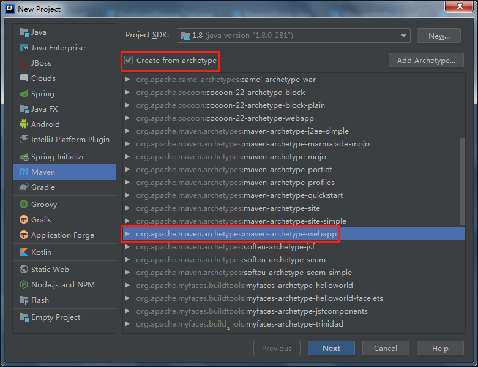

构建项目



完善目录结构


正确的文件结构是这样的，一开始创建的项目缺少了java和test文件夹，这两个文件夹需要手动来创建。手动创建的文件夹一开始是没有标识的，在IDEA中以java文件夹为例如果没有标识为Sources Root文件夹将无法在该文件夹内包或Java源文件。如果需要进行标识可以`右键文件夹->Mark directory as->选择文件夹标识`。


引入项目依赖


```xml
<properties>
    <maven.compiler.source>1.8</maven.compiler.source>
    <maven.compiler.target>1.8</maven.compiler.target>
    <!-- 设置项目编码编码 -->
    <project.build.sourceEncoding>UTF-8</project.build.sourceEncoding>
    <project.reporting.outputEncoding>UTF-8</project.reporting.outputEncoding>
    <!-- spring版本号 -->
    <spring.version>4.3.5.RELEASE</spring.version>
    <!-- mybatis版本号 -->
    <mybatis.version>3.4.1</mybatis.version>
</properties>

<dependencies>
    <!-- java ee -->
    <dependency>
        <groupId>javax</groupId>
        <artifactId>javaee-api</artifactId>
        <version>7.0</version>
    </dependency>

    <!-- 单元测试 -->
    <dependency>
        <groupId>junit</groupId>
        <artifactId>junit</artifactId>
        <version>4.12</version>
    </dependency>

    <!-- 实现slf4j接口并整合 -->
    <dependency>
        <groupId>ch.qos.logback</groupId>
        <artifactId>logback-classic</artifactId>
        <version>1.2.2</version>
    </dependency>

    <!-- JSON -->
    <dependency>
        <groupId>com.fasterxml.jackson.core</groupId>
        <artifactId>jackson-databind</artifactId>
        <version>2.8.7</version>
    </dependency>


    <!-- 数据库 -->
    <dependency>
        <groupId>mysql</groupId>
        <artifactId>mysql-connector-java</artifactId>
        <version>8.0.23</version>
    </dependency>


    <!-- 数据库连接池 -->
    <dependency>
        <groupId>com.mchange</groupId>
        <artifactId>c3p0</artifactId>
        <version>0.9.5.2</version>
    </dependency>

    <!-- MyBatis -->
    <dependency>
        <groupId>org.mybatis</groupId>
        <artifactId>mybatis</artifactId>
        <version>${mybatis.version}</version>
    </dependency>

    <!-- mybatis/spring整合包 -->
    <dependency>
        <groupId>org.mybatis</groupId>
        <artifactId>mybatis-spring</artifactId>
        <version>1.3.1</version>
    </dependency>

    <!-- Spring核心及各个组件 -->
    <dependency>
        <groupId>org.springframework</groupId>
        <artifactId>spring-core</artifactId>
        <version>${spring.version}</version>
    </dependency>
    <dependency>
        <groupId>org.springframework</groupId>
        <artifactId>spring-beans</artifactId>
        <version>${spring.version}</version>
    </dependency>
    <dependency>
        <groupId>org.springframework</groupId>
        <artifactId>spring-context</artifactId>
        <version>${spring.version}</version>
    </dependency>
    <dependency>
        <groupId>org.springframework</groupId>
        <artifactId>spring-jdbc</artifactId>
        <version>${spring.version}</version>
    </dependency>
    <dependency>
        <groupId>org.springframework</groupId>
        <artifactId>spring-tx</artifactId>
        <version>${spring.version}</version>
    </dependency>
    <dependency>
        <groupId>org.springframework</groupId>
        <artifactId>spring-web</artifactId>
        <version>${spring.version}</version>
    </dependency>
    <dependency>
        <groupId>org.springframework</groupId>
        <artifactId>spring-webmvc</artifactId>
        <version>${spring.version}</version>
    </dependency>
    <dependency>
        <groupId>org.springframework</groupId>
        <artifactId>spring-test</artifactId>
        <version>${spring.version}</version>
    </dependency>
</dependencies>
```


配置web.xml

```xml
<!DOCTYPE web-app PUBLIC
 "-//Sun Microsystems, Inc.//DTD Web Application 2.3//EN"
 "http://java.sun.com/dtd/web-app_2_3.dtd" >

<web-app xmlns="http://xmlns.jcp.org/xml/ns/javaee"
         xmlns:xsi="http://www.w3.org/2001/XMLSchema-instance"
         xsi:schemaLocation="http://xmlns.jcp.org/xml/ns/javaee http://xmlns.jcp.org/xml/ns/javaee/web-app_3_1.xsd"
         version="3.1">
  <display-name>Archetype Created Web Application</display-name>

  <!-- 编码过滤器 -->
  <filter>
    <filter-name>encodingFilter</filter-name>
    <filter-class>org.springframework.web.filter.CharacterEncodingFilter</filter-class>
    <init-param>
      <param-name>encoding</param-name>
      <param-value>UTF-8</param-value>
    </init-param>
  </filter>
  <filter-mapping>
    <filter-name>encodingFilter</filter-name>
    <url-pattern>/*</url-pattern>
  </filter-mapping>

  <!-- 配置DispatcherServlet -->
  <servlet>
    <servlet-name>SpringMVC</servlet-name>
    <servlet-class>org.springframework.web.servlet.DispatcherServlet</servlet-class>
    <!-- 配置springMVC需要加载的配置文件-->
    <init-param>
      <param-name>contextConfigLocation</param-name>
      <param-value>classpath:/conf/spring-*.xml</param-value>
    </init-param>
    <load-on-startup>1</load-on-startup>
    <async-supported>true</async-supported>
  </servlet>
  <servlet-mapping>
    <servlet-name>SpringMVC</servlet-name>
    <!-- 匹配所有请求 -->
    <url-pattern>/</url-pattern>
  </servlet-mapping>
</web-app>
```


配置Spring组件及整合Mybatis

```xml
<!-- spring-mybatis.xml-->
<?xml version="1.0" encoding="UTF-8"?>
<beans xmlns="http://www.springframework.org/schema/beans"
       xmlns:xsi="http://www.w3.org/2001/XMLSchema-instance"
       xmlns:context="http://www.springframework.org/schema/context" xmlns:tx="http://www.springframework.org/schema/tx"
       xsi:schemaLocation="http://www.springframework.org/schema/beans
       http://www.springframework.org/schema/beans/spring-beans.xsd
       http://www.springframework.org/schema/context
       http://www.springframework.org/schema/context/spring-context.xsd http://www.springframework.org/schema/tx http://www.springframework.org/schema/tx/spring-tx.xsd">

    <!-- 扫描service包下所有使用注解的类型 -->
    <context:component-scan base-package="com.non.ssm_integration"/>

    <!-- 配置数据库相关参数properties的属性! -->
    <context:property-placeholder location="classpath:conf/jdbc.properties"/>

    <!-- 数据库连接池 -->
    <bean id="dataSource" class="com.mchange.v2.c3p0.ComboPooledDataSource">
        <property name="driverClass" value="${jdbc.driver}"/>
        <property name="jdbcUrl" value="${jdbc.url}"/>
        <property name="user" value="${jdbc.username}"/>
        <property name="password" value="${jdbc.password}"/>
        <property name="maxPoolSize" value="${c3p0.maxPoolSize}"/>
        <property name="minPoolSize" value="${c3p0.minPoolSize}"/>
        <property name="autoCommitOnClose" value="${dataSource.autoCommitOnClose}"/>
        <property name="checkoutTimeout" value="${c3p0.checkoutTimeout}"/>
        <property name="acquireRetryAttempts" value="${c3p0.acquireRetryAttempts}"/>
    </bean>

    <!-- 配置SqlSessionFactory对象 -->
    <bean id="sqlSessionFactory" class="org.mybatis.spring.SqlSessionFactoryBean">
        <!-- 注入数据库连接池 -->
        <property name="dataSource" ref="dataSource"/>
        <!-- 扫描entity包 使用别名 -->
        <property name="typeAliasesPackage" value="com.non.ssm_integration.entity"/>
        <!-- 扫描sql配置文件:mapper需要的xml文件 -->
        <property name="mapperLocations" value="classpath:/mapper/*.xml"/>
    </bean>

    <!-- 配置扫描Dao接口包，动态实现Dao接口，注入到spring容器中 -->
    <bean class="org.mybatis.spring.mapper.MapperScannerConfigurer">
        <!-- 注入sqlSessionFactory -->
        <property name="sqlSessionFactoryBeanName" value="sqlSessionFactory"/>
        <!-- 给出需要扫描Dao接口包 -->
        <property name="basePackage" value="com.non.ssm_integration.dao"/>
    </bean>

    <!-- 配置事务管理器 -->
    <bean id="transactionManager" class="org.springframework.jdbc.datasource.DataSourceTransactionManager">
        <!-- 注入数据库连接池 -->
        <property name="dataSource" ref="dataSource"/>
    </bean>

    <!-- 配置基于注解的声明式事务 -->
    <tx:annotation-driven transaction-manager="transactionManager"/>
</beans>
```

配置spring mvc

```xml
<!-- spring-mvc.xml -->
<?xml version="1.0" encoding="UTF-8"?>
<beans xmlns="http://www.springframework.org/schema/beans"
       xmlns:xsi="http://www.w3.org/2001/XMLSchema-instance"
       xmlns:context="http://www.springframework.org/schema/context"
       xmlns:mvc="http://www.springframework.org/schema/mvc"
       xsi:schemaLocation="http://www.springframework.org/schema/beans
       http://www.springframework.org/schema/beans/spring-beans.xsd
       http://www.springframework.org/schema/context
       http://www.springframework.org/schema/context/spring-context.xsd
       http://www.springframework.org/schema/mvc
       http://www.springframework.org/schema/mvc/spring-mvc-3.0.xsd">

    <!-- 扫描web相关的bean -->
    <context:component-scan base-package="com.non.ssm_integration.controller"/>

    <!-- 开启SpringMVC注解模式 -->
    <mvc:annotation-driven/>

    <!-- 静态资源默认servlet配置 -->
    <mvc:default-servlet-handler/>

    <!-- 配置jsp 显示ViewResolver -->
    <bean class="org.springframework.web.servlet.view.InternalResourceViewResolver">
        <property name="viewClass" value="org.springframework.web.servlet.view.JstlView"/>
        <property name="prefix" value="/WEB-INF/views/"/>
        <property name="suffix" value=".jsp"/>
    </bean>
</beans>
```

配置logback

```xml
<!-- logback.xml -->
<?xml version="1.0" encoding="UTF-8"?>
<configuration debug="true">
    <appender name="STDOUT" class="ch.qos.logback.core.ConsoleAppender">
        <encoder>
            <pattern>%d{HH:mm:ss.SSS} [%thread] %-5level %logger{36} - %msg%n</pattern>
        </encoder>
    </appender>
    <root level="debug">
        <appender-ref ref="STDOUT"/>
    </root>
</configuration>
```

