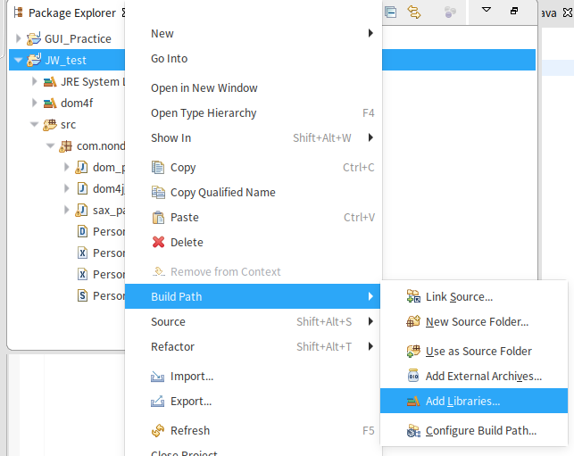

# dom4j

## 安装dom4j

首先在网上搜索dom4j，从官网下载到dom4j的jar包之后




根据图中的一顿操作之后，选择dom4j User Library添加即可

## dom4j解析器的构建

```java
import org.dom4j.io.SAXReader;
import org.dom4j.Document;

SAXReader sr = new SAXReader();
Document document = sr.read(xmlFilePath);
```


## 查询xml文档的基础方法

```java
import org.dom4j.Element;
import java.util.List;

Element root = document.getRootElement();  //获得整个xml文档的根标签
List<Element> list1 = root.elements();  //当前标签下的所有子标签对象
Element e = root.element(tagName);  //获取当前标签下的第一个名为tagName的子标签对象
List<Element list2 = root.elements(tagName);  //获取当前标签下所有名为tagName的子标签对象
e.getName();  //获取标签名称
e.getText();  //获取标签内容
```

下面贴出一个对xml文件遍历的代码例程

```java
import java.util.List;

import org.dom4j.Document;
import org.dom4j.Element;
import org.dom4j.io.SAXReader;

public class dom4j_test{
	public static void main(String[] args) throws Exception{
		SAXReader sr = new SAXReader();
		Document document = sr.read("./Person.xml");
		Element root = document.getRootElement();
		listDocument(root);
	}
	
	public static void listDocument(Element e) {
		System.out.print(e.getName());
		System.out.println(":"+e.getText());
		List<Element> l = e.elements();
		for(Element ele:l) {
			listDocument(ele);
		}
	}
}

```

## 子标签追加

在dom4j当中，我们只要调用父标签对象的`addElement(tagName)` 方法,再然后使用上述方法返回的Element对象使用`setText(stringContent)` 方法编辑其内容，最后把变动回写到xml文件当中就能够完成子标签的追加

```java
import org.dom4j.Document;
import org.dom4j.Element;
import org.dom4j.io.OutputFormat;
import org.dom4j.io.SAXReader;
import org.dom4j.io.XMLWriter;

SAXReader sr = new SAXReader();
Document document = sr.read("./Person.xml");
Element root = document.getRootElement();
Element en = root.addElement("name");
Element ef = en.addElement("firstName");
Element el = en.addElement("lastName");
ef.setText("Mari");
el.setText("Ya");
```


## 回写xml文档

```java
XMLWriter xw = new XMLWriter(new FileOutputStream("./Person.xml"), OutputFormat.createPrettyPrint());  
xw.write(document);
```

在`XMLWriter(new FileoutputStream("./Person.xml"), OutputFormat.createPrettyPrint());` 这段代码中

- 第一个参数就表示回写的xml文档的文件输出流
- 第二个参数是回写文档的格式 ,传入`OutputFormat.createPrettyPrint()` 就表明回写xml文档将使用漂亮的格式