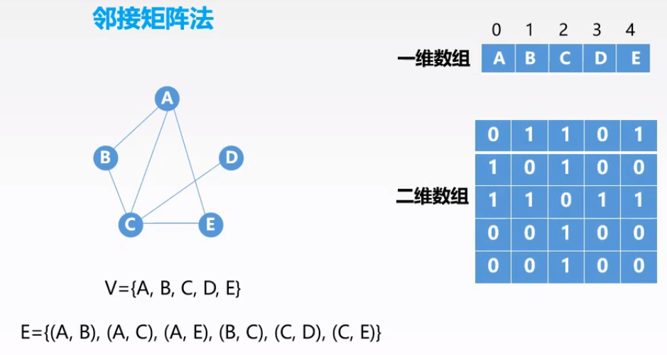
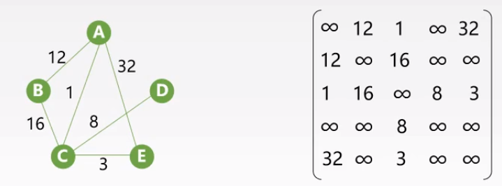

## 图

### 图的基本概念

什么是图？

​	图是点与点之间的连接关系，由点、边构成。`G[图]= {V[点],E[边]}`

#### 有向图和无向图

无向图：点与点之间的对为无序对，如(A,B)。

有向图：点与点之间的对为有序对，如<A,B>。

#### 简单图和多重图

​	前者不存在重复的边和自身与自身连接的边

#### 完全图

1.  无向完全图

    任意两个顶点之间都存在边，边的数量为`n(n-1)/2`

2.  有向完全图

    任意两个顶点之间都存在方向相反的两条边，边的数量为`n(n-1)`

#### 子图与生成子图

子图：存在`G(V,E)`与`G'(V',E')`有V包含V’,E包含E’责成G’为G的子图

生成子图：`V(G) = V'(G')`则成G’为G的生成子图

#### 路径

1.  简单路径

    两个点之间的路径中顶点不重复的路径为简单路径。

2.  路径长度

    路径上边的数目，如果这条路径最短，则称这条路径的路径长度为距离。

3.  回路

    第一个顶点与最后一个顶点相同的路径称为回路。

#### 连通图

什么是连通、强连通？

​	连通：假设无向图中有点A、B，A到B存在有路径则成A点与B点是连通的。

​	强连通：假设有向图中有点A、B，如果存在A到B和B到A的路径则称A点与B点是强连通的。

什么是连通图、强连通图？

​	连通图：图中任意两点都是连通的。

​	强连通图：图中任意两点都是强连通的。

什么是连通分量（极大连通子图）、强连通分量（极大强连通子图）？

​	首先需要确定，（强）连通分量是一个（强）连通图，并且这个连通图是原图当中能够找到的最大的两连通图，即存在`G`的连通子图`G’`，在`G`当中不能够找到其他的连通子图`G''`包含`G'`。

​	如果连通分量的原图本身就是连通图的话，那么其连通分量就是其本身。

什么是极小连通子图？

​	和连通分量相反，是保证图连通的情况下最小的连通子图。

#### 生成树与生成森林

什么是生成树？

​	生成树的原图为连通图，生成树包含原图的全部顶点并且是极小连通子图

什么是生成森林 ？

​	==非连通图==的==所有连通分量==的==生成树==的集合

从图还能够推出一个跟树结构类似的有向树，名字虽然是树但是其本质还是图。

​	有向树：一个顶点入度为0，其余顶点入度为1的有向图。

### 邻接矩阵法构建图

邻接矩阵法构建图是顺序存储结构存储，一个数组存储顶点集，另一个二维数组存储顶点之间关系的有序对，这个二维数组即为邻接矩阵。

具体下来要分成两种情况创建，如果是图的话，邻接矩阵当中有边相连接用1表示没有则用0表示，如果是网的话每条边还有相应的权值。

无向图的邻接矩阵构成如下：

图中二维数组的第一行第二列的元素表示从顶点A到顶点B有一条有向边，第二行第一列的元素表示从顶点B到顶点A有一条有向边，两者一同表示A和B之间存在一条无向边。

一位数组当中携带的信息：顶点名称，顶点索引由顶点名称得到

同理可以有向图的构成

如果是网，邻接矩阵的值就不能够简单的用0和1来表示，因为顶点与顶点之间有相应的权值。如果顶点之间有相应的权值边，在邻接矩阵中相应位置元素的值为相应权值，如果顶点之间没有边，则邻接矩阵相应位置元素的值为正无穷(正无穷的值由自己定义)。

无向网的邻接矩阵构成如下：

另外，图邻接矩阵还有特殊的性质。

首先，在无向图的邻接矩阵的第i列或第i行的和为顶点V~i~的度，在有向图当中邻接矩阵第i行的和为顶点 V~i~的出度，第i列的和为顶点V~i~的入度。

其次，邻接矩阵的幂A^n^[i][j]的值的意义为顶点V~i~到顶点V~j~长度为n的路径的条数。

### 邻接表法构建图

邻接表法构建图使用到的是链式存储结构，分别有一个顶点集和边集，其中每个顶点元素除包含顶点数据外还有一个块存储空间存储该顶点的边集头指针。

图示如下：

有关图的具体构成代码在这里省略。

### 广度优先搜索

广度优先搜索类似于树的层次遍历，在图中以出发顶点到各顶点的路径长为层次。

### 深度优先搜索

### 最小生成树Prim法

 	1. 使用上面两种搜索实现某些功能
 	2. 最小生成树prim法