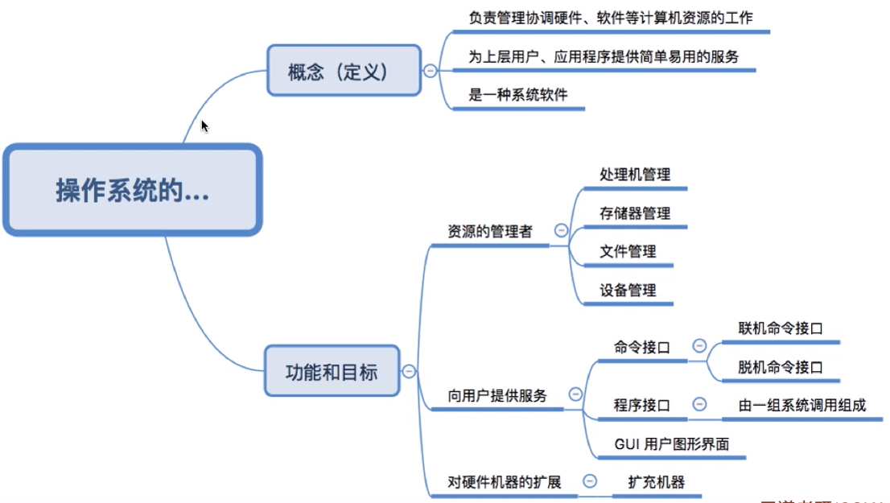

# 操作系统的相关概念

##  操作系统的概念、功能、目标

### 概念

操作系统(Operating System, OS)：是指控制和管理整个计算机系统的硬件和软件资源，并合理地组织调度计算机的工作和资源分配，以提供给用户和其他软件方便的接口和环境的软件集合。

### 功能和目标

**资源的管理者**：

1. 处理机管理：管理处理器资源。
2. 存储器管理：管理内存资源。
3. 文件管理：抽象硬盘中的数据为面向操作系统用户的文件资源，并且对其进行管理
4. 设备管理：对计算机硬件的设备资源进行管理，如驱动键盘鼠标等外接设备运作。

命令接口：命令接口是向用户提供的直接通过命令使用计算机的接口。

​    联机命令接口：交互式的命令接口，命令一句一句的下达、执行。类同Windows操作系统中的命令行。

​    脱机命令接口：批处理形式的命令接口。

**程序接口**：程序接口是操作系统给软件提供的接口，操作系统通过程序接口简介的向用户提供服务。其由一组系统调用组成。比如Windows下的dll，程序员通过程序接口来开发应用程序，最终供用户使用。

**GUI接口**：操作系统提供的GUI操作界面，供用户以图形交互来使用计算机。

**对硬件机器的扩充**：整合机器资源对其进行封装供用户使用。

## 操作系统的四个特征

1. **并发性**：并发是指两个或多个程序在同一时间间隔内发生或者说多任务是交替执行。操作系统的并发性是指操作系统中同时存在多个运行着的程序，对任务进行并发式的处理。

2. **共享性**：是指系统中的资源可 供内存中的多个并发执行的进程共同使用，操作系统的共享性有互斥共享方式和同时共享方式两种方式。

   1) 互斥共享方式，在某项资源在某个程序占用时，这项资源不能够被其他程序使用到，只有这项资源在闲置的状态下其他程序才能够使用到，比如说摄像头在进行视频通话时是不能够同时进行拍照任务的。

   2) 同时共享方式，这种方式下多个程序能够同时对某项资源进行访问，比如说硬盘资源。但在微观角度下可能是互斥的，也可能是同时的。

3. **虚拟性**：指把一个物理上的实体变为若干个逻辑上的对应物。操作系统的虚拟性详细可以分成时分复用共享和空分复用共享。

   1) 空分复用共享：空分复用是指多个程序或用户同时使用一个资源的不同部分。

   2) 时分复用共享：时分复用是指当多个程序或用户想要使用同一个资源时而采取的策略。每个程序或用户需要按照一定的顺序依次使用这个资源。

4. **异步性**：在多道程序环境下，允许多个程序并发执行，但是由于资源有限，进程的执行不一定是连贯到底，而是走走停停。如打印机请求，而此时打印机正在为其他的进程打印。由于打印机是临界资源，因此正在执行的进程必须等待，并且要放弃处理机。直到打印机空闲，并再次把处理机分配给该进程时，该进程才能继续执行。

并发其实在微观角度下时交替执行的，在微观角度下同时执行的指的是并行。在操作系统的四个特征当中，并发性和共享性是互为存在前提条件的，并且虚拟性和异步性也需要具有并发性和共享性时才能够存在。

## 操作系统的发展

在**手工操作阶段**使用打孔纸片插入到纸片机中由纸片机输入数据到计算机，计算机计算完成之后又由纸片机输出纸片予用户。在这个阶段存在人机速度的矛盾：用户输入数据速度与计算机计算速度相差巨大。

到了**批处理阶段**，首先出现的是单道批处理系统，其引入脱机输入输出技术使用磁带作为介质预输入、输出，缓解了人机速度的矛盾，但是此时CPU仍然有大量时间是用在等待I/O程序完成，资源利用率依旧很低。然后又出现了多道批处理系统，多道批处理系统能够使多道程序并发执行，但却不具备人机交互能力（提交程序执行后只能等待程序执行完成，在此期间不能够对程序进行控制）。其中单道批处理系统就是串行模式，而多道批处理系统就是流水线模式。

然后又出现了**分时操作系统**，分时操作系统将时间分为若然个时间片用户轮流享有一个时间片，在属于某个用户的时间片内用户能够控制程序执行。但这样还是有一定缺陷，分时操作系统对资源的分配基本是平均的，如果存在某个用户有紧急任务时无法让某个任务优先执行。

为了解决优先处理紧急任务这个问题，随后诞生了**实时操作系统**。实时操作系统又分为硬实时系统和软实时系统，其中硬实时系统对于紧急任务必须在绝对严格的规定时间内完成处理，而软实时系统则偶尔能够微弹时间规定。

## 操作系统的运行机制与体系结构

### 运行机制

**什么是指令？**

指令是CPU能直接识别并执行的指令。我们编写的每一条程序语句就是由若干条指令所组成的。在操作系统中，指令又分为特权指令和非特权指令。

**特权指令是什么？非特权指令又是什么？**

特权指令是指有特权权限的指令，由于这类指令的权限最大，如果使用不当，将导致整个系统崩溃。比如：清内存、置时钟、分配系统资源、修改虚存的段表和页表，修改用户的访问权限等，并且特权指令是不允许用户程序使用的。而非特权指令则不如特权指令一般权限高，并且相对安全。

前者只能够在核心态下执行，后者则在核心态和用户态下都能够执行。

**什么是核心态？什么是用户态？**

核心态和用户态是CPU的两种状态。在**核心态（管态）**下CPU能够执行特权指令和非特权指令，在**用户态（目态）**下CPU只能够执行非特权指令。

根据程序运行在哪种CPU状态下可以分成内核程序和应用程序。其中**内核程序**是系统的管理者，可以执行两种指令运行在核心态下。而为了保证系统的安全，普通**应用程序**只能够执行非特权指令，运行在用户态下。

### 操作系统内核及体系结构

操作系统的内核是计算机上配置的底层软件，是最基本最核心的部分。根据操作系统内核包含的内容可以将内核分为**大内核结构**和**微内核结构**。

操作系统内核包含时钟管理、中断处理、原语和对操作系统进行管理的功能（进程管理、设备管理、存储器管理）。其中微内核仅包含时钟管理、中断处理和原语这三部分，而大内核除此之外还包含对操作系统进行管理的功能。

两种结构都有利有弊。

**微内核**仅包含最基本的功能，其内核功能少、结构清晰、维护简单，但是其经常需要在核心态和用户态两种切换导致其性能相对较低。

**大内核**除微内核包含的内容以外还有对操作系统进行管理的功能，因为其包含了对操作系统进行管理的功能，所以其CPU状态相对微内核而言较少、性能较高，但是内核中包含的功能多，所以代码庞大、结构混乱、难以维护。

## 中断和异常

**如何区分外、内中断？**

内中断：中断的发生与正在执行的指令有关。内中断又能够分为指令中断、硬件故障中断和软件中断。

​	指令中断：中断由程序发起通常是一些对IO的请求，当前任务需要CPU介入管理。

​	硬件故障中断：如内存缺页这样的情况。CPU介入以后能够纠正。

​	软件中断：程序执行时出现故障，并且该故障CPU介入也无法纠正。

外中断：中断的发生与当前正在执行的指令无关，可以分为外设请求和人工干预。

​	外设干预：如打印机打印任务完成，键盘键入。

​	人工中断：。。。

## 系统调用

**为什么应用程序要通过系统调用来获取操作系统的服务？**

如果用户程序拥有使用系统调用中的几种功能的权限，那么如果用户程序随意、争抢使用这几项资源时会出现混乱甚至出现故障，为了保证系统的稳定性和安全性，所以这几项关键功能操作系统以系统调用的形式交给用户程序，后者通过系统调用来请求操作系统进行协调管理。

执行陷入指令之后，CPU就将会从用户态转为核心态。陷入指令是在用户态执行的，也是唯一一个可以在用户态下执行不可在核心态下执行的指令。

# 进程

## 进程的定义、组成、组织方式、特征

### 进程的定义

在多道程序技术之后，为了方便操作系统管理，完成各程序并发执行，引入进程。当多个程序并发执行时每个进程的程序段和数据段会载入到计算机的内存当中，但是在计算机中同时存在的进程必定是不止一个的，并且除内存资源之外的其他资源也不一定仅由一个进程所占用。为了区分每个每个进程所占用的资源以及保存进程的状态等信息就有了**进程控制块(Process Control Block)**。

由程序段、数据段和进程控制块组成一个进程的进程实体。这是一个静态的概念。

进程是具有独立功能的程序在数据集合上的运行过程，它是系统进行资源分配和调度的一个独立单位。进程一个运行过程，强调**动态性**。进程也就是进程实体的运行过程，大部分情况下不区分两者概念。所谓创建进程就是创建进程实体中的PCB，而撤销进程就是撤销进程实体中的PCB。

### 进程的组成

 进程控制块：操作系统是通过PCB来管理进程，因此PCB中应该包含操作系统对其进行管理所需的各种信息，如进程描述信息、进程控制和管理信息、资源分配清单和处理机相关信息。

 程序段：程序指令存放的位置。

 数据段：程序运行时使用、产生的运算数据。如全局变量、局部变量、宏定义的常量就存放在数据段内。

### 进程的组织形式

进程的组织形式可以为**链接方式**和**索引方式**。

链接方式：

索引方式：

### 进程的特征

**异步性**是指进程以不可预知的速度向前推进。内存中的每个进程何时执行,何时暂停,以怎样的速度向前推进,每道程序总共需要多少时间才能完成等,都是不可预知的。是程序并发执行时，程序之间的相互制约关系导致了并发程序这种“执行——暂停——执行”这种间断性的活动规律。

比如，当正在执行的进程提出某种资源请求时，如打印请求，而此时打印机正在为其他某进程打印，由于打印机属于临界资源，因此正在执行的进程必须等待，且放弃处理机，直到打印机空闲，并再次把处理机分配给该进程时，该进程方能继续执行。可见，由于资源等因素的限制，进程的执行通常都不是“一气呵成”，而是以“停停走走”的方式运行。
————————————————
版权声明：本文为CSDN博主「柳婼」的原创文章，遵循CC 4.0 BY-SA版权协议，转载请附上原文出处链接及本声明。
原文链接：https://blog.csdn.net/liuchuo/article/details/51986221

## 进程的状态与状态间的转换

### 进程的状态

进程是程序的一次执行，执行期间进程的状态是会发生各种变化的，具体可以分为一下几种状态：

1. 运行状态：此刻进程正占用CPU资源并且正在运行，需要注意的是在单核CPU的环境下每个时刻==仅能==有一个进程处于运行状态，双核CPU环境下==可以==有两个进程处于运行状态。
2. 就绪状态：此刻进程除CPU外拥有了其他所有执行需要的资源，一旦进程获得处理机则可立即进入运行状态。
3. 阻塞状态：在这个状态下进程需要等待操作系统分配其他资源，如打印机设备资源、磁盘读取操作等。在获取到这些资源以后就可以转回就绪状态。
4. 创建状态：一个进程的创建不是立即就能够完成的，进程实体的创建也是需要时间的。在这期间进程处于创建状态。
5. 终止状态：一个进程的销毁也不是立即就能够完成的，进程占用资源的回收也需要等待。在此期间进程处于终止状态。

### 状态间的转换

具体如导图所示。

需要注意的是，进程状态间的转换不能够直接跳过某些状态。比如说进程的创建状态完成以后不能够直接转换到运行状态还需要进入到就绪状态等待。并且进程进入到终止状态的条件是进程在执行期间遇到不可修复的错误或进程运行结束，阻塞状态和就绪状态不能够直接转到终止状态，因为它们的任务还没有完成，并且没有处于运行状态。

## 进程控制

进程控制的功能目标就是对进程今晚管理，实现进程的创建和销毁，以及各进程状态间的转换。那么进程控制又是如何实现的呢？

以之前讲到的链接方式的进程组织形式为例子。有四个角色：就绪队列、阻塞队列、CPU和操作系统。

1. 创建状态—>就绪状态：操作系统创建进程，创建完成后将进程提交到就绪队列中，提交进程到就绪队列这个过程需要有修改PCB中相应的内容（如修改进程的状态)及相应队列。
2. 就绪状态—>运行状态 ：进程接受操作进程调度进入运行状态，移出就绪队列并修改PCB中相应的内容及相应队列，另外还需要恢复进程的运行环境（原先进程运行时的运行环境）。
3. 运行状态—>就绪状态：保存进程的运行环境，修改PCB中相应的内容及相应队列。
4. 运行状态—>阻塞状态：保存进程的运行环境，修改PCB中相应的内容及相应队列。
5. 阻塞状态—>就绪状态：运行状态遇到的错误已经修复或等待的资源已经获取，修改PCB中相应的内容及相应队列。
6. 运行状态—>终止状态：回收相应资源，撤销PCB。

思考这样一个问题，假如在这些进程状态转换的过程中，仅修改了PCB中的内容和修改了相应的队列但时没有恢复进程的运行环境会怎么样？如果出现之类的情况是会导致不可预知的错误的，为了避免这样的事件的发生，进程状态转换的一系列操作会被放在原语当中执行。

其中原语的执行是一气呵成不会中途被中断的，其原理是怎样的？

原语的执行的一开始首先执行的是**关中断指令**，开启了关中断指令以后所有的中断信号都会被搁置等待原语内容执行完毕后执行**开中断指令**，开中断指令执行以后才会受理中断信号。

进程控制原语有以下几类。

进程创建：

进程终止：

进程切换：

## 进程通信

为了保证进程的安全，各进程的空间都是相互独立的，而且各进程之间不能够直接访问其他进程的内存空间。但是进程之间还是需要相互同信的，为此操作系统有三种进程间通信的方式。

### 共享存储

共享存储这种通信方式是在内存中设立一个共享空间，各进程通过访问这个共享空间来实现通信。这种通信方式是必须互斥的，也就是同一时间只能够有一个进程访问这个共享空间，为了保证互斥操作系统一般使用P、V操作来实现。

共享存储具体还能够分为两种：一是**基于数据结构的共享**，这种方式只能够在共享空间内放长度为10的数组，这种方式通信慢、限制多属于低级通信方式。二是**基于存储区的共享**这，这种方式是在内存当中划分一部分空间用于数据共享，但是其通信的具体操作是由进程自己来完成的。

### 管道通信

如导图中关于管道通信的内容。另外需要注意一点，管道通信是一对一的通信，因为管道中的数据被读取完只有就消失了无法恢复。如果有第三进程通信可能会造成数据的错误传输和丢失。

### 消息传递

消息传递通信方式使用的是格式化的消息进行通信的（类同http传输协议，具有消息头和消息体），并且其接收使用的是操作系统提供的接收/发送原语。

消息传递通信方式也可以分为两种：一是**直接通信方式**，这种通信方式进程有一条消息缓冲队列，发送消息的进程发送的消息挂到接收消息进程的消息缓冲队列队尾，由接收消息的进程从消息缓冲队列中取出消息完成通信。二是**间接通信方式**，这种通信方式会在内存中设立一个通信信箱，发送消息的进程会使用发送原语将消息发送到信箱当中，接收消息的进程会使用接收原语在信箱当中取出消息，因为在格式化消息的消息头当中包含了发送进程的ID和接收消息进程的ID，所以不用担心接收方无法在信箱当中找到消息的问题。

## 线程的概念和线程模型

### 线程的概念

通常情况下一个程序的执行不可能仅仅包含一个任务，比如说微信在文字聊天的同时也还要兼顾影音聊天。传统进程的概念只能够完成一个任务，所以为了增加并发度出现了**线程**。至于线程则可以理解为“轻量化的进程”，是程序执行流的最小单元。

### 引入线程带来的变化

对于系统开销来说，原先需要在进程之间切换，而每一次切换都要恢复到进程之前的运行环境，但是有了线程以后，如果切换的线程是在同一个进程下的线程则不需要改变运行环境，因为在同一个进程之下的线程是共享资源的。

### 线程的属性

### 线程的实现方式

线程的实现具体可以分成两种实现方式：**用户级线程**和**内核级线程**。

**用户级线程**是在进程内的，这种线程的调度是由进程管理，所以它不是处理机调度的单位。也就是说在该线程的进程处于运行状态时再由进程调度其用户级线程后这些线程才能得以运行。所以用户级线程是对进程可视的而对操作系统是透明的。

**内核级线程**才是直接受处理机调度的单位，它们俩的区别就是当处理机进行调度时内核级线程直接转为当前线程执行，而用户级线程还需要处理机调度使该线程的进程进入运行状态时由该进程进行调度该线程才能得以运行。并且用户级线程的切换在用户态下就能够完成，而内核级线程需要在核心态下才能够完成。

在具体使用时进程进程会将两种实现方式进行组合。

### 多线程模型

**一对多模型**

一个内核级线程对应多个用户级线程，在当前内核级线程在处理机中运行时用户级线程才能够根据进程调度运行。这种模型进程内的各个线程在用户态下就能够完成调度所以开销小、效率高。但是当有用户级线程出现阻塞时整个进程都会停止运行等待请求完成。

**一对一模型**

一对一模型克服了一对多模型的缺点，但是创建一个用户线程就要创建一个相应的内核线程。由于创建内核线程的开销会影响应用程序的性能，所以这种模型的大多数实现限制了系统支持的线程数量。

**多对多模型**

多对多模型多路复用多个用户级线程到同样数量或更少数量的内核线程。多对多模型就没有上面两种模型的缺点了，当某个用户线程出现阻塞导致某个内核线程阻塞时可以调度另外一个内核线程服务其他用户线程。

## 进程调度的时机、切换与过程

**什么时候不能够进行进程调度？**

一是在处理中断的过程中。中断处理过程过于复杂，并且与硬件息息相关，很难做到在中断处理的过程中进行进程切换。

二是在原子操作的过程中，由于原子操作不可中断，要一气呵成，所以在此期间也不能够进行进程调度和切换。

三是进程在操作系统内核程序临界区中时：

临界资源：在同一时间内只能有一个进程使用的资源。

临界区：访问临界资源的代码。

内核程序临界区：一般用于访问某种内核数据结构，比如说就绪队列。

内核程序临界区所访问的数据结构在被其访问时是会被上锁的，即只能够被当前进程访问，比如说该数据结构是就绪队列，进行线程调度就需要访问到就绪队列，但是就绪队列此刻却无法被访问到。所以说在此期间是无法进行进程调度和切换的。

**狭义的“调度”和“切换",以及广义“调度”**

狭义上的进程调度指按照某种算法在就绪队列中选择一个要运行的进程，而进程切换指的是某个进程让出处理机给另外一个进程。

而广义上的进程调度就包含了狭义上的进程调度和进程切换。

## 调度算法的评价指标

**CPU利用率**

CPU被占用时其工作的时间以及被占用的总时间之比：$\Large{\frac{CPU工作时间}{总占用时间}}$。

**系统吞吐量**

单位时间内完成的作业数量：$\Large{\frac{完成作业数量}{总花费时间}}$。

**周转时间**

**平均周转时间**

**带权周转时间**