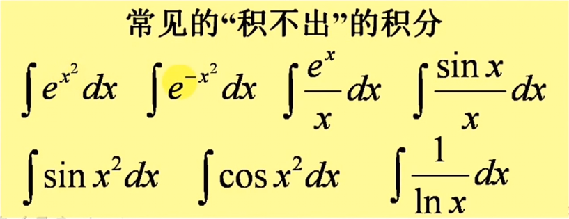

### 二重积分的计算法（直角坐标系）

图1

红、绿、蓝分别为X、Y、Z轴

圆柱底面为区域D

图2

#### X型区域的二重积分

假设x∈(a,b)  y∈(ψ1(x),ψ2(x))

使用x=G对图形进行截面，截面面积为

把其中的x当做常数进行积分

然后对每(a,b)的截面进行积分得到图形的体积为

即

由此可以类推Y型区域的二重积分

#### 积分区域非X型区域也非Y型区域的二重积分

将积分区域分割成若干个X区和Y区进行积分，随后将积分累加

### 改变已知二次积分的积分次序

已知$\iint_{D}f(x,y)=\int_{a}^{b}\int_{c}^{d}f(x,y)$

画出二次积分的积分区域图像

根据图像得出另一种积分次序的二重积分

### 变限定积分的求导

在$\varphi(x)$和$\psi (x)$都可导,$f(x)$连续的情况下，对$\int_{\varphi (x)}^{\psi (x)}f(x)$求导有

$\LARGE \frac{d(\int_{\varphi (x)}^{\psi (x)}f(t)dt)}{dx}=f[\varphi(x)]\varphi(x)'-f[\psi(x)]\phi(x)'$

### 常见的“积不出”的积分

### 对于积不出的积分的解决方法

使用改变已知二次积分的积分次序或变限定积分的求导这两种方法解决

例:$\large\int_{0}^{1} dx\int_{2x}^{2} e^{y^2}dy​$

一、变限定积分求导

1. 把$\large \int_{2x}^{2}e^{y^2}dy​$视为x的函数$\large u(x)​$

2. 对$\large\int_{0}^{1} dx\int_{2x}^{2} e^{y^2}dy$进行分部积分

   $\LARGE \int_{0}^{1} dx\int_{2x}^{2} e^{y^2}dy=\int_{0}^{1} x[\int_{2x}^{2}e^{y^2}]-\int_{0}^{1}xd(\int_{2x}^{2}e^{y^2} )$

3. 对$u(x)​$进行变限定积分求微分

   $\LARGE =\int_{0}^{1}xu(x)-\int_{0}^{1}-2xe^{(2x)^2}dx=0+\frac{1}{4}\int_{0}^{1}e^{4x^2} d(4x^2)=\frac{1}{4}(e^4-1)$

二、改变二次积分的积分顺序

1. 改变二次积分的积分顺序

   $\LARGE \int_{0}^{1} dx\int_{2x}^{2} e^{y^2}dy=\int_{0}^{2}dy\int_{0}^{\frac{y}{2}}e^{y^2}dx​$

2. 化简

   $\LARGE \int_{0}^{2}e^{y^2}dy\int_{0}^{\frac{y}{2}}dx=\int_{0}^{2}\frac{y}{2}e^{y^2}dy=\frac{1}{4}\int_{0}^{1}e^{y^2} d(y^2)$

3. 得出结果

   $\LARGE =\frac{1}{4}(e^4-1)$